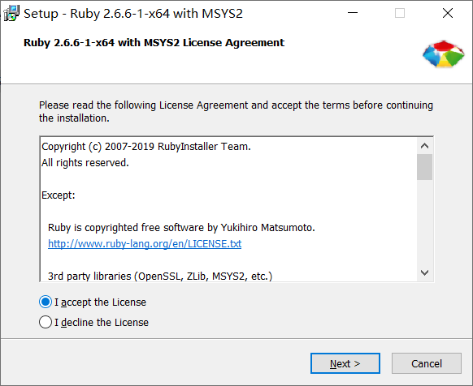
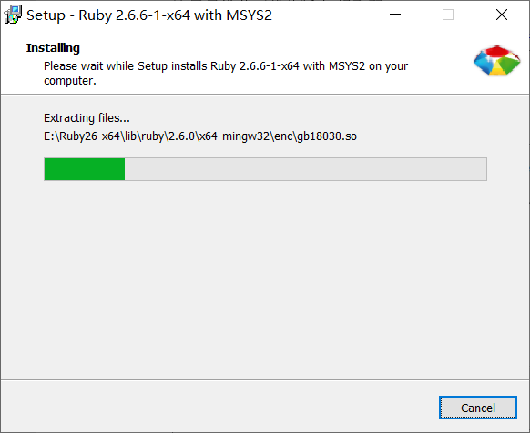
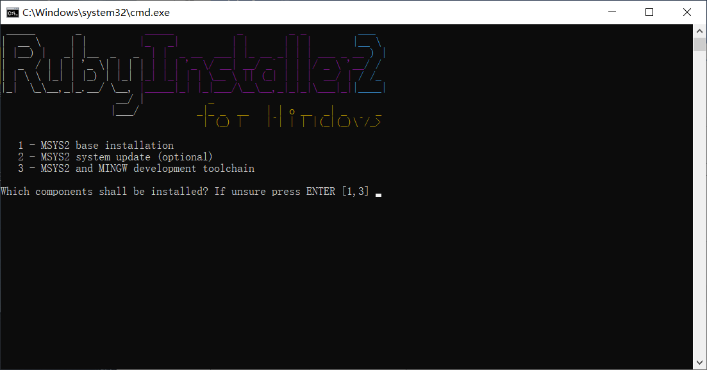
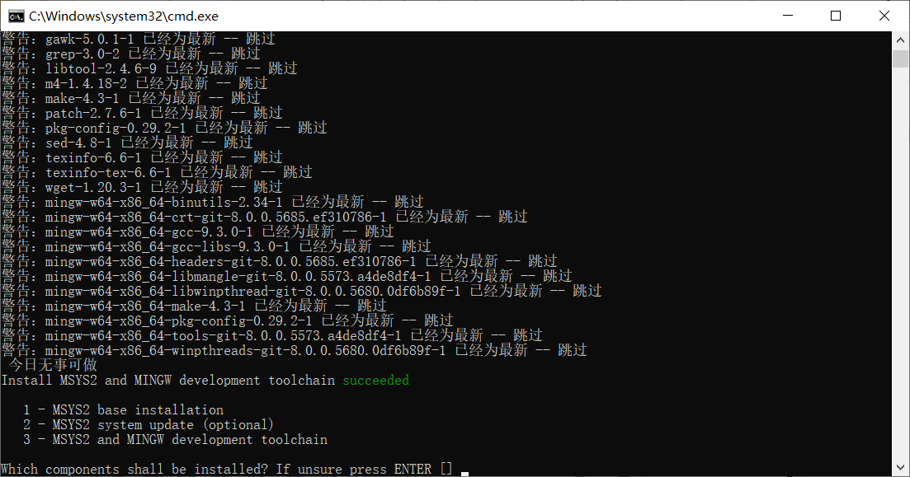
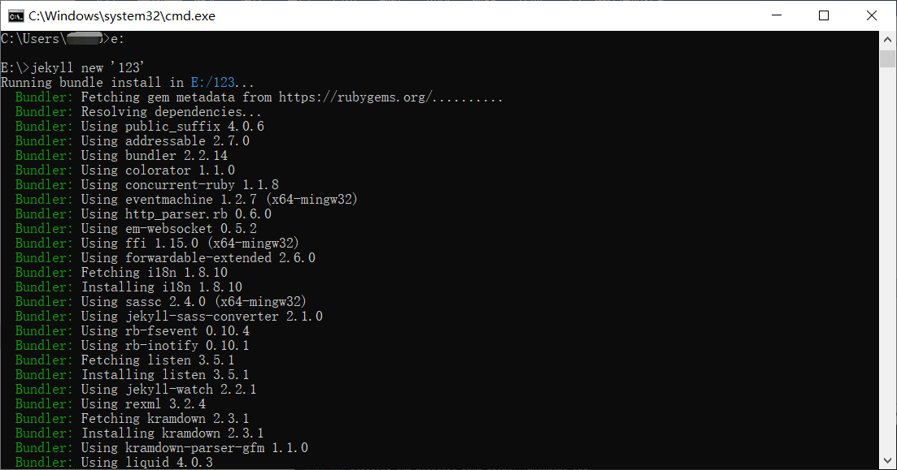
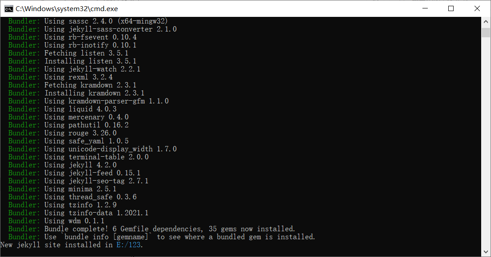
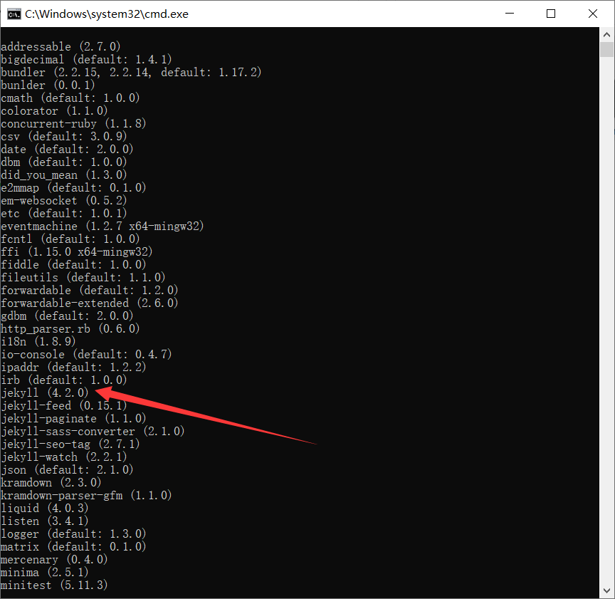

# 准备篇：

## 一、Ruby

### Ruby的安装

这里只推荐下载此版本(提取码：6hd3)

[rubyinstaller-devkit-2.6.6-1-x64.exe](https://pan.baidu.com/s/11iqKNyDOEQFT50EuKnrfDQ)

安装过程：

**此处输入 3，Enter键即可**

到这里安装完毕退出即可。[**注**]（由于我这里已经安装过一遍，所以显示会有所不同。）

### Ruby的测试

(1) 打开cmd（win键+r—>输入cmd—>Enter键）

(2) 输入下列代码

> ruby -v

出现下图即为**安装成功**

## 二、Jekyll

### Jekyll的安装

(1) 接上面，在cmd命令框内输入:

> gem intall jekyll

如果需要安装指定版本，在上述命令后加上一个**-v**参数

> gem install jekyll -v ‘指定版本号’

(2) [安装失败的解决办法]( https://www.zhihu.com/question/51994604/answer/130671714)（成功跳过即可）

### Jekyll测试

**有时间折腾别的模板的guys，请继续以下操作：**

(1) 我本想要在e:盘的根目录下创建一个博客，命名为123（也充当一个jekyll能否使用的测试），后来手残又安装了一遍ruby,new 新博客的时候发现一些类似于**包**版本的兼容问题。

> #更新：这里的版本限制在gemfile里，暂时没有尝试修改，有朋友修改后兼容多个版本时请务必给我留言。

> e:

> jekyll new ‘123’

 在e:进入该目下，执行下列操作：

> cd 123

> jekyll serve

> 

**这里是一眼钟情于黄玄大佬博客的操作：**

> gem list

到此，出现上图，即为安装成功。

## 三、Git安装

(1)关于下载

这里推荐[官网](https://gitforwindows.org/)和[镜像](https://npm.taobao.org/mirrors/git-for-windows/)，我这里选择官网版本。

[点击查看安装步骤](https://www.cnblogs.com/xueweisuoyong/p/11914045.html)

