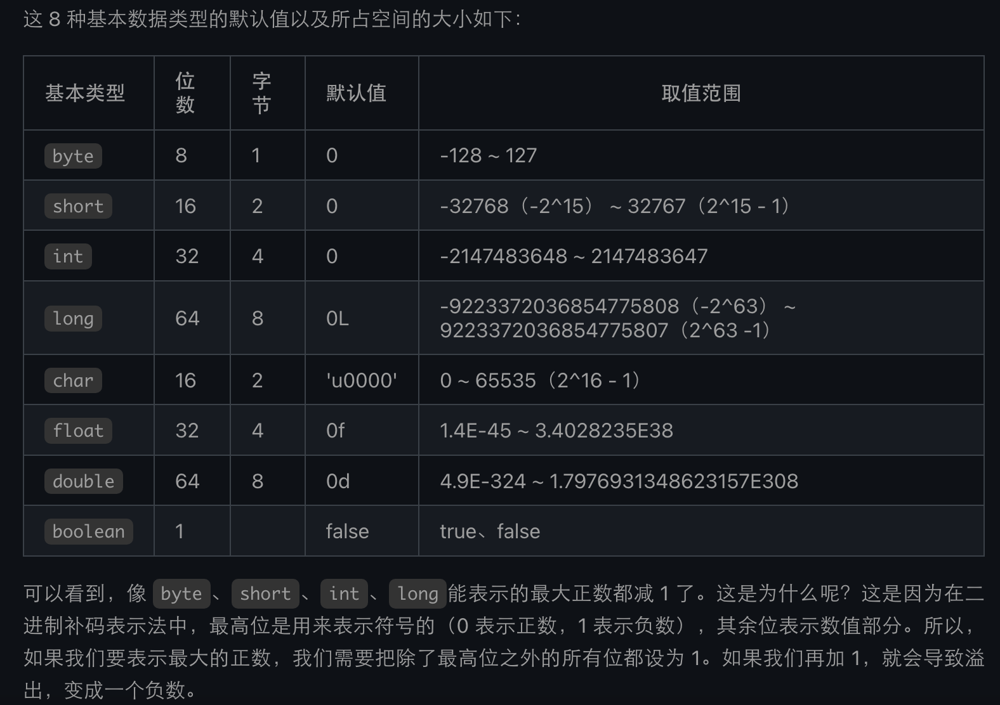
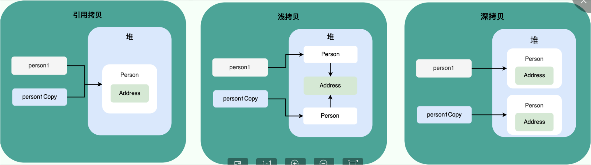
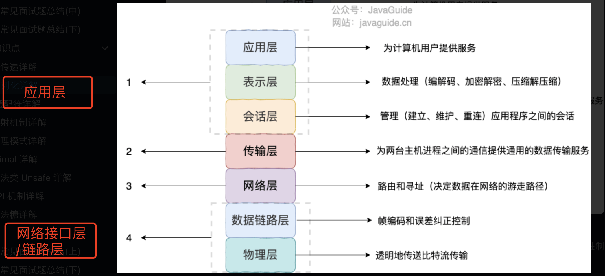

## 1. 重载和重写的区别？
发生阶段不同，重载发生在编译期，重写发生在运行期。

重载：
1. 发生在同一个类中(或者父类和子类之间),所以访问修饰符范围没有限制
2. 方法名必须相同
3. 参数类型不同、个数不同、顺序不同
4. 方法返回值和访问修饰符可以不同。

重写：
1. 访问修饰符范围大于等于父类。
2. 方法名、参数列表必须相同
3. 子类方法返回值类型应比父类方法返回值类型更小或相等
4. 抛出的异常范围小于等于父类
5. 构造方法无法被重写

```java
class Parent {
    static void staticMethod() {
        System.out.println("Static method in Parent");
    }
}

class Child extends Parent {
    static void staticMethod() {
        System.out.println("Static method in Child");
    }
}

public class Main {
    public static void main(String[] args) {
        Parent obj = new Child();

        // 调用的是Parent类中的静态方法，因为是基于引用类型
        obj.staticMethod(); // 输出：Static method in Parent
    }
}
```

如果父类方法访问修饰符为 private/final/static 则子类就不能重写该方法，但是被 static 修饰的方法能够被再次声明。
1. 子类可以声明一个与父类中的静态方法具有相同签名的静态方法，但这不被视为方法的重写，而是称为"方法隐藏"。在这种情况下，子类中的静态方法与父类中的静态方法没有多态性的关系，而是独立存在的。
2.   如果子类和父类都声明一个staticMethod， `Parent obj = new Child(); `调用 `obj.staticMethod()` 仍然会调用 `Parent` 类中的静态方法。
3. 如果父类中没有定义静态方法，但是调用 `obj.staticMethod()` 时会调用子类 `Child` 中的静态方法。这是因为方法的隐藏是基于引用类型而不是实际对象类型的。


## 2. 基本类型和包装类型的区别？（延伸问题：包装类的缓存机制、自动装拆箱）

默认值：基本数据类型有默认值，包装类为null



存储方式：都存在堆中。
	注意：
	1. 基本数据类型存放在栈中是一个常见的误区！ 基本数据类型的成员变量 如果没有被 static 修饰的话（不建议这么使用，应该要使用基本数据类型对应的包装类型），就存放在堆中。）
	2. 只有使用`static final`修饰的基本数据类型的成员变量才会被放入常量池中。

占用空间：相比包装类，基本数据类型占用小

比较方式：包装类用equals，基本数据类型用==

包装类缓存机制：

 **Byte,Short,Integer,Long 这 4 种包装类默认创建了数值 [-128，127] 的相应类型的缓存数据，Character 创建了数值在 [0,127] 范围的缓存数据，Boolean 直接返回 True or False。**

## 3. 自动装箱与拆箱了解吗？原理是什么？

装箱：将基本类型用它们对应的引用类型包装起来；

拆箱：将包装类型转换为基本数据类型；

举例：
```
Integer i = 10; //装箱
int n = i;   //拆箱
```

## 4. 浮点数的精度损失原因？

由于计算机存储浮点数的存储机制有关，十进制0.2转成二进制，出现无限循环小数就会被截断影响精度。

### 如何解决浮点数运算的精度丢失问题？
使用BigDecimal

- 创建：BigDecimal(String val)构造方法或BigDecimal.valueOf(double val) 静态方法来创建对象。

- add 方法用于将两个 BigDecimal 对象相加
- subtract 方法用于将两个 BigDecimal 对象相减。
- multiply 方法用于将两个 BigDecimal 对象相乘
- divide 方法用于将两个 BigDecimal 对象相除。
- compareTo 方法用于比较两个BigDecimal
- a.compareTo(b) : 
	- 返回 -1 表示 a 小于 b
	- 0 表示 a 等于 b 
	- -1 表示 a 大于 b。

- setScale 方法用于保留几位小数。
```
BigDecimal n = m.setScale(3,RoundingMode.HALF_DOWN);
```
- [工具类](#bigdecimal-%E5%B7%A5%E5%85%B7%E7%B1%BB%E5%88%86%E4%BA%AB)

### 超过 long 整型的数据应该如何表示？

Long最长的64位使用 BigDecimal其实底层用int[]。

## 5. 面向对象和面向过程的区别

面向过程把解决问题的过程拆成一个个方法，通过一个个方法的执行解决问题。

面向对象会先抽象出对象，然后用对象执行方法的方式解决问题。

## 6. 接口类和抽象类的区别 ？

共同点：

- 都不能被实例化。（不能被直接调用）
- 都可以包含抽象方法。
- 都可以有默认实现的方法（Java 8 可以用 default 关键字在接口中定义默认方法）。

区别：

- 接口主要用于对类的行为进行约束，实现了某个接口就具有了对应的行为（比如查询接口）。抽象类主要用于代码复用，强调的是所属关系。
- 一个类只能继承（extends）一个类，但是可以实现（implements）多个接口。
- 接口中的成员变量只能是 public static final 类型的，不能被修改且必须有初始值，而抽象类的成员变量默认 default，可在子类中被重新定义，也可被重新赋值 。

## 7. 深拷贝和浅拷贝的区别？


## 8. **Java加载的最核心的类是什么？**

Java加载的最核心的类是java.lang.Object。所有的Java类都直接或间接地继承自Object类。Object类提供了一些基本的方法，如equals、hashCode、toString等，因此它是整个类继承体系的根。

当Java虚拟机加载一个类时，它首先加载Object类，然后再加载其他类。因此，Object类在Java类加载机制中具有特殊的地位，被认为是加载的最核心的类。

## 9. equals和 == 的区别
== ：基本数据类型比较的是值 引用数据类型比较的是地址  
equals： 未重写相当于==  重写比较的是值
注意：
	Object的equals是原生的未重写的（比较的是对象中的内存地址），String中的是重写过的，所以String的equals比较的是值
```java
package com.example.bagu;  
  
public class equalsDemo {  
  
          public static void main(String[] args) {  
                    String str1 = "abc";  
                    String str2 = new String("abc");  
                    String str3 = "abc";  
                    String str4 =  "xxx";  
                    String str5 = "abc" + "xxx";  
  
                    String s3 = "cbd";  
                    String s4 = "cbd";  
                    String str6 = s3 + s4;  
  
                    // == ：基本数据类型比较的是值 引用数据类型比较的是地址  
                    // equals： 未重写相当于==  重写 比较的是值  
                    System.out.println("str1 == str2：" + (str1 == str2));  
                    // 正确：false == String是引用类型，比较的是地址  
                    // 因为它们分别指向字符串池中的常量字符串和堆内存中新创建的字符串对象，这两个对象在内存中的地址是不同的。  
  
                    System.out.println(str1);  
                    System.out.println(str2);  
  
                    System.out.println("str1.equals(str2)：" + (str1.equals(str2)));// true  
                    // ⬆️Object的equals是原生的未重写的（比较的是对象中的内存地址），  
                    // String中的是重写过的，所以String的equals比较的是值  
                    // 但是这里str1 是常量池中abc的值。 str2值是对象的  
  
                    System.out.println("str1 == str5：" + (str1 == str5)); // false  
                    System.out.println("str1 == str6：" + (str1 == str6)); // false  
                    System.out.println("str5 == str6：" + (str5 == str6)); // true -》false 两个不同的object  
                    System.out.println("str5.equals(str6)：" + (str5.equals(str6))); // true -》false 同上  
  
                    //str.intern() 是 Java 中的一个方法，它的作用是返回字符串对象的规范化表示形式。  
                    // 具体来说，如果字符串常量池中已经包含一个等于此String对象的字符串（由 equals 方法确定），  
                    // 则返回常量池中对应字符串的引用；  
                    // 否则，将该String对象添加到常量池中，并返回该String对象的引用。  
  
                    //        使用 str.intern() 主要是为了在字符串比较时  
                    //        ，使用 == 进行引用比较，而不是 equals 方法进行内容比较，以提高比较效率。  
                    System.out.println("str1 == str6.intern()：" + (str1 == str6.intern())); //false  
                    System.out.println("str1 == str2.intern()：" + (str1 == str2.intern())); //true  
  
          }  
}
```

```java
/*
	在String的`equals`方法中，首先检查是否是同一个对象，如果是直接返回`true`。接着判断传入的对象是否为`String`类型，如果不是则返回`false`。然后，比较两个字符串的长度，如果长度相等再逐字符比较它们的内容。如果存在任何一个字符不相等，返回`false`，否则返回`true`。这样，`String`类的`equals`方法实际上比较的是字符串的内容。这种方式是符合字符串相等比较的常规期望的。
*/
public boolean equals(Object anObject) {
    if (this == anObject) {
        return true;
    }
    if (anObject instanceof String) {
        String anotherString = (String) anObject;
        int n = value.length;
        if (n == anotherString.value.length) {
            char v1[] = value;
            char v2[] = anotherString.value;
            int i = 0;
            while (n-- != 0) {
                if (v1[i] != v2[i])
                    return false;
                i++;
            }
            return true;
        }
    }
    return false;
}

```

## 10.  为什么重写 equals() 时必须重写 hashCode() 方法？

关键词：实例应用于Hash集合中 存储一致性 数据丢失泄漏 

因为Object是所有类的父类，重写的equals方法而不重写hashCode()方法，这个类的实例可能会被用在哈希集合中，就会导致HashMap和HashSet在集合中存储的对象就不一致。
所以重写equals就必须重写hashCode方法。不一致问题会导致数据丢失泄露（指用一个对象查找另外一个对象时由于他们在不一样的hash桶中。在哈希表中，相等的对象应该被散列到相同的哈希桶中，而不是不同的桶中。）

## 11.  String、StringBuffer、StringBuilder 的区别？
关键词 可变性 线程安全性 性能

1. 可变性
String是不可变的（Java8中：`String` 类的内部字符数组（`char[]`）被声明为 `final`，所以不可变）
StringBuffer和StringBuilder是可变的（他们的父类方法AbstractStringBuilder都提供了append方法）

2. 线程安全性
String 不可变，理解为常量，线程安全的
StringBuffer 加了同步锁，线程安全的
StringBuilder 没有对调用方法加同步锁，是非线程安全的

3. 性能
操作少量的数据: 适用 String
单线程操作字符串缓冲区下操作大量数据: 适用 StringBuilder
多线程操作字符串缓冲区下操作大量数据: 适用 StringBuffer

4. 扩展
Java9中String改用byte存储。（byte 相较 char 节省一半的内存空间）

## 12. String的+本质是什么？

是StringBuilder调用append方法（数组拷贝）和toString方法生成的字符串。

## 13. String的equals() 和 Object的equals() 有何区别？

String 中的 equals 方法是被重写过的，比较的是 String 字符串的值是否相等。
Object 的 equals 方法是比较的对象的内存地址。

## 14. String的intern 方法有什么作用?
```java
// 在堆中创建字符串对象”Java“

// 将字符串对象”Java“的引用保存在字符串常量池中

String s1 = "Java";

// 直接返回字符串常量池中字符串对象”Java“对应的引用

String s2 = s1.intern();

// 会在堆中在单独创建一个字符串对象

String s3 = new String("Java");

// 直接返回字符串常量池中字符串对象”Java“对应的引用

String s4 = s3.intern();

// s1 和 s2 指向的是堆中的同一个对象

System.out.println(s1 == s2); // true

// s3 和 s4 指向的是堆中不同的对象

System.out.println(s3 == s4); // false

// s1 和 s4 指向的是堆中的同一个对象

System.out.println(s1 == s4); //true

```

## 15. Exception异常和Error异常

Exception :程序本身可以处理的异常，可以通过 catch 来进行捕获。分为Checked Exception 受检异常（如果不处理，编译时会报错。）和 Unchecked Exception 运行时异常（在运行时可能抛出但并不强制要求处理的异常）。

Error：程序本无法处理的异常（包括Java 虚拟机运行错误（Virtual MachineError）、虚拟机内存不够错误(OutOfMemoryError)、类定义错误（NoClassDefFoundError）等），这些错误发生时，一般虚拟机会主动终止线程。

### 运行时异常和非运行时（受检查异常）异常

Checked Exception 即 受检查异常 ，Java 代码在编译过程中，如果受检查异常没有被 catch或者throws 关键字处理的话，就没办法通过编译。

除了RuntimeException及其子类以外，其他的Exception类及其子类都属于受检查异常 。常见的受检查异常有：IO 相关的异常、ClassNotFoundException、SQLException...。

RuntimeException 及其子类都统称为非受检查异常，常见的有（建议记下来，日常开发中会经常用到）：

- NullPointerException(空指针错误)

- IllegalArgumentException(参数错误比如方法入参类型错误)

- NumberFormatException（字符串转换为数字格式错误，IllegalArgumentException的子类）

- ArrayIndexOutOfBoundsException（数组越界错误）

- ClassCastException（类型转换错误）

- ArithmeticException（算术错误）

- SecurityException （安全错误比如权限不够）

- UnsupportedOperationException(不支持的操作错误比如重复创建同一用户)

……

**扩展：**

[**Throwable 类常用方法有哪些？**](#throwable-%E7%B1%BB%E5%B8%B8%E7%94%A8%E6%96%B9%E6%B3%95%E6%9C%89%E5%93%AA%E4%BA%9B)

[**try和finally中都有return返回哪个？**](#try-catch-finally-%E5%A6%82%E4%BD%95%E4%BD%BF%E7%94%A8)

## 16. finally中的代码一定会执行吗？

 - catch块中有  `System.exit(1);`（终止当前正在运行的Java虚拟机），finally就不会执行。
- 程序所在的线程死亡。
- 关闭 CPU。

## 18. [**如何使用 try-with-resources 代替try-catch-finally？**](https://javaguide.cn/java/basis/java-basic-questions-03.html#%E5%A6%82%E4%BD%95%E4%BD%BF%E7%94%A8-try-with-resources-%E4%BB%A3%E6%9B%BFtry-catch-finally)
手动关闭
```java
//读取文本文件的内容
Scanner scanner = null;
try {
    scanner = new Scanner(new File("D://read.txt"));
    while (scanner.hasNext()) {
        System.out.println(scanner.nextLine());
    }
} catch (FileNotFoundException e) {
    e.printStackTrace();
} finally {
    if (scanner != null) {
        scanner.close();
    }
}
```

使用 Java 7 之后的 `try-with-resources` 语句改造上面的代码:
```java
// 自动关流
try (Scanner scanner = new Scanner(new File("test.txt"))) {
    while (scanner.hasNext()) {
        System.out.println(scanner.nextLine());
    }
} catch (FileNotFoundException fnfe) {
    fnfe.printStackTrace();
}
```
try-with-resource 多资源关流
```java
try (BufferedInputStream bin = new BufferedInputStream(new FileInputStream(new File("test.txt")));
     BufferedOutputStream bout = new BufferedOutputStream(new FileOutputStream(new File("out.txt")))) {
    int b;
    while ((b = bin.read()) != -1) {
        bout.write(b);
    }
}
catch (IOException e) {
    e.printStackTrace();
}
```

## 19. 异常使用有哪些需要注意的地方？
- 不要把异常定义为静态变量，因为这样会导致异常栈信息错乱。每次手动抛出异常，我们都需要手动 new 一个异常对象抛出。
- 抛出的异常信息一定要有意义。
- 建议抛出更加具体的异常比如字符串转换为数字格式错误的时候应该抛出`NumberFormatException`而不是其父类`IllegalArgumentException`。
- 使用日志打印异常之后就不要再抛出异常了（两者不要同时存在一段代码逻辑中）。


## 20. **泛型应用场景？**
泛型是指可以应用多种类型的对象的类、接口、方法。

应用场景：
- Collection中的 sort, binarySearch 方法 
- 自定义的 Excel 处理类 ExcelUtil<T> 用于动态指定 Excel 导出的数据类型

## 21. 反射原理？（实现一个自定义日志注解）
### 反射概念
通过反射，可以获取任意一个类的所有属性和方法，你还可以调用这些方法和属性。

### Java反射机制的原理：
1. Class对象：**每个加载到JVM中的类都会对应一个Class对象**，它是反射的核心入口点。

2. 获取元数据：通过**Class对象获取器**，可以获取到该类的所有公共、保护、默认（包访问权限）以及私有字段、方法和构造细信息。

3. 实例化与调用：**反射允许我们创建对象实例**，即使构造函数是私有的；还可以调用任意方法，不论其访问修饰符如何，并且可以修改或读取属性值，突破了编译期静态类型绑定的限制。

4. 运行时类修改：尽管不常见，反射还支持在运行时创建新的类或者修改已有类的结构（例如通过Constructor.newInstance()创建对象，Method.invoke()调用方法，Field.set()设置属性值等）。

### 反射缺点
让我们在运行时有了分析操作类的能力，这同样也增加了安全问题。比如可以无视泛型参数的安全检查（泛型参数的安全检查发生在编译时）。另外，反射的性能也要稍差点，不过，对于框架来说实际是影响不大的。相关阅读：[Java Reflection: Why is it so slow?open in new window](https://stackoverflow.com/questions/1392351/java-reflection-why-is-it-so-slow)

### 四个反射的方式
当我们使用 `Object.getClass()` 或 `Class.forName()` 等方法获取 Class 对象时，Java 虚拟机通过 JNI 调用底层的本地方法。
```java
// 1类.class（静态）
Class alunbarClass = TargetObject.class;

// 2传入类的全路径
Class alunbarClass1 = Class.forName("cn.javaguide.TargetObject");

// 3通过对象实例获取
TargetObject instance = new TargetObject();
Class alunbarClass2 = instance.getClass();

// 4通过类加载器，传入类的全路径获取（类似2）
ClassLoader.getSystemClasssLoader.loaderClass("cn.javaguide.TargetObject");

```

### [反射基本操作](https://javaguide.cn/java/basis/reflection.html#%E5%8F%8D%E5%B0%84%E7%9A%84%E4%B8%80%E4%BA%9B%E5%9F%BA%E6%9C%AC%E6%93%8D%E4%BD%9C)


## 22. 注解的解析方法有哪几种?

- 注解只有被解析之后才会生效，常见的解析方法有两种：

- 编译期直接扫描：编译器在编译 Java 代码的时候扫描对应的注解并处理，比如某个方法使用@Override 注解，编译器在编译的时候就会检测当前的方法是否重写了父类对应的方法。

- 运行期通过反射处理：像框架中自带的注解(比如 Spring 框架的 @Value、@Component)都是通过反射来进行处理的。

## 23. SPI机制原理（实现）
Java 中的 SPI 机制就是在每次类加载的时候会先去找到 class 相对目录下的 `META-INF` 文件夹下的 services 文件夹下的文件，将这个文件夹下面的所有文件先加载到内存中，然后根据这些文件的文件名和里面的文件内容找到相应接口的具体实现类，
找到实现类后就可以通过反射去生成对应的对象，保存在一个 list 列表里面，所以可以通过迭代或者遍历的方式拿到对应的实例对象，生成不同的实现。

## 24.JDK动态代理和CGLIB动态代理
JDK动态代理
**通过`Proxy` 类的 `newProxyInstance()` 创建的代理对象在调用方法的时候，实际会调用到实现`InvocationHandler` 接口的类的 `invoke()`方法。** 你可以在 `invoke()` 方法中自定义处理逻辑，比如在方法执行前后做什么事情。

**简单demo**
1. 自定义一个类，实现`InvocationHandler`接口， 并重写`invoke`方法，在 `invoke` 方法中我们会调用原生方法（被代理类的方法）并自定义一些处理逻辑；
 2. 通过 `Proxy.newProxyInstance(ClassLoader loader,Class<?>[] interfaces,InvocationHandler h)` 方法创建代理对象；
目标类的类加载器 
代理需要实现的接口，可指定多个 new DebugInvocationHandler(target)
代理对象对应的自定义 
3. 写一个Service，声明一个方法。写一个main方法，调用JDKProxyFactory传入代理类，强制转换，调用方法测试，完成动态代理。

Cglib动态代理
** JDK 动态代理有一个最致命的问题是其只能代理实现了接口的类。**
在 CGLIB 动态代理机制中 `MethodInterceptor` 接口和 `Enhancer` 类是核心。
你需要自定义 `MethodInterceptor` 并重写 `intercept` 方法，`intercept` 用于拦截增强被代理类的方法。

**简单demo**
1. 自定义一个类，实现`MethodInterceptor`接口，并重写 `intercept` 方法，`intercept` 用于拦截增强被代理类的方法，和 JDK 动态代理中的 `invoke` 方法类似是invokeSuper；
2. 自定义一个CglibProxyFactory，创建一个getProxy，入参是`Class<?> clazz`，调用 CglibProxy中声明Enhancer，设置类加载器、被代理的类、重写的拦截器。返回 `Enhancer` 类的 `create()`创建代理类；
3. 写一个Service，声明一个方法。写一个main方法，调用CglibProxyFactory传入代理类.class，强制转换，调用方法测试，完成动态代理。

### 区别
1. **JDK 动态代理只能代理实现了接口的类或者直接代理接口，而 CGLIB 可以代理未实现任何接口的类。** 另外， CGLIB 动态代理是通过生成一个被代理类的子类来拦截被代理类的方法调用，因此不能代理声明为 final 类型的类和方法。
2. 就二者的效率来说，大部分情况都是 JDK 动态代理更优秀，随着 JDK 版本的升级，这个优势更加明显。

## 25.序列化详解
 **序列化**：将数据结构或对象转换成二进制字节流的过程
 **反序列化**：将在序列化过程中所生成的二进制字节流转换成数据结构或者对象的过程

### 序列化场景
- 对象在进行网络传输（比如远程方法调用 RPC 的时候）之前需要先被序列化，接收到序列化的对象之后需要再进行反序列化；
- 将对象存储到文件之前需要进行序列化，将对象从文件中读取出来需要进行反序列化；
- 将对象存储到数据库（如 Redis）之前需要用到序列化，将对象从缓存数据库中读取出来需要反序列化；
- 将对象存储到内存之前需要进行序列化，从内存中读取出来之后需要进行反序列化。

### 序列化属于哪一层协议
因为，OSI 七层协议模型中的应用层、表示层和会话层对应的都是 TCP/IP 四层模型中的应用层，所以序列化协议属于 TCP/IP 协议应用层的一部分。

### [常见序列化协议有哪些？](https://javaguide.cn/java/basis/serialization.html#%E4%BB%80%E4%B9%88%E6%98%AF%E5%BA%8F%E5%88%97%E5%8C%96%E5%92%8C%E5%8F%8D%E5%BA%8F%E5%88%97%E5%8C%96)

## [26. unSafe类](https://javaguide.cn/java/basis/unsafe.html)


## 27.Java类的加载机制？

Java类的加载机制主要包括三个步骤：加载（Loading）、链接（Linking）、初始化（Initialization）。

加载（Loading）：通过类加载器将.class文件加载到内存中。

链接（Linking）：分为三个阶段：

- 验证（Verification）：确保加载的类符合Java虚拟机规范，没有安全方面的问题。

- 准备（Preparation）：为类的静态变量分配内存，并设置默认初始值。

- 解析（Resolution）：将类、接口、字段和方法的符号引用解析为直接引用。

初始化（Initialization）：对类的静态变量赋予正确的初始值，执行静态代码块。


## 28.JDK8

### jdk1.8的新特性有哪些？

- lamad表达式
- stream流
- localDate和localDateTime日期类

### stream流和for的区别？

stream流可以看作是for循环的一个语法糖；

stream有并发流，在超过百万级数据量时，使用stream流效率更高；

### stream流可以收集多次吗？

stream属于管道流，只能消费一次，当第一个stream流调用完毕方法,数据就会流转到下一个Stream上

而这时第一个stream流已经使用完毕，就会关闭了，所以第一个Stream流就不能再调用方法

#### stream().map()时，stream是否已经被操作了？

不是，stream流属于惰式执行。stream上的操作并不会立即执行，只有等到用户真正需要结果的时候才会执行。

### localDate和 Date的区别？

localDate 和 localDateTime是对java.util.Date强有力的补充，解决了 Date 类的大部分痛点：

1. 非线程安全
2. 时区处理麻烦
3. 各种格式化、和时间计算繁琐
4. 设计有缺陷，Date 类同时包含日期和时间；还有一个 java.sql.Date，容易混淆。
