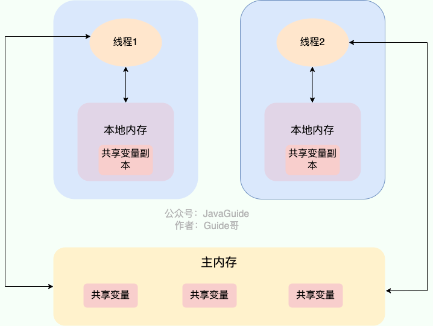

## 多线程常用的类和同步
常用的多线程类包括：

1. **Thread**：代表一个线程，可以通过继承Thread类或实现Runnable接口来创建线程。

2. **Runnable**：定义了一个可运行的任务，通常用于创建线程。

3. **ExecutorService**：线程池的抽象类，用于管理和调度线程。

4. **Future**：表示异步计算的结果，可以用于获取线程执行的结果。

5. **ThreadPoolExecutor**：线程池的具体实现类，用于管理线程池中的线程。

6. **CountDownLatch**：一个同步辅助类，用于等待多个线程完成任务。

7. **CyclicBarrier**：也是一个同步辅助类，用于多个线程之间相互等待，直到到达某个共同点。

8. **Semaphore**：控制同时访问某个资源的线程数量。

9. **BlockingQueue**：阻塞队列，用于实现生产者-消费者模式。

10. **Lock** 和 **ReentrantLock**：用于实现显式的锁定机制，提供了比synchronized更灵活的锁操作。


常用的同步机制包括：

1. **synchronized**：Java语言提供的关键字，用于实现同步方法或同步代码块，保证多个线程之间的互斥访问。
2. **volatile**：用于标记变量，保证可见性，但不保证原子性。
3. **Lock** 和 **ReentrantLock**：提供了显式的锁定和解锁机制，可以替代synchronized。
4. **Atomic** 包：提供了一系列原子操作类，如 AtomicInteger、AtomicLong 等，保证了单个操作的原子性。
5. **ConcurrentHashMap**：线程安全的哈希表实现，采用分段锁机制，提高并发性能。 

这些类和机制可以帮助开发者实现线程安全的并发编程。选择合适的类和机制取决于具体的需求和场景。

## 串行和并发

串行（Serial）和并发（Concurrent）是指多个任务的执行方式。

1. **串行（Serial）**：
- 在串行执行中，多个任务按照顺序一个接一个地执行，每个任务必须等待前一个任务完成后才能开始执行。
- 任务之间是顺序执行的，没有并发执行的情况，因此任务的执行顺序是确定的。

2. **并发（Concurrent）**：
- 在并发执行中，多个任务可以同时进行，任务之间可以重叠执行，彼此独立运行。
- 任务之间可以按照不同的顺序执行，不同任务的执行顺序可能不确定，因此需要考虑并发控制和同步问题。

总的来说，串行执行是按照顺序一个接一个地执行任务，而并发执行是允许多个任务同时进行，并可能重叠执行。串行执行通常会消耗更少的系统资源，但可能会导致执行时间较长；而并发执行可以提高系统的效率和性能，但需要考虑并发控制和同步问题。

## 进程和线程
### 进程、线程、协程
进程是程序的一次执行过程，是操作系统资源分配的最⼩单位，因此进程是动态的。系统运行一个程序即是一个进程从创建，运行到消亡的过程。

线程是操作系统任务调度和执⾏的最⼩单位，归属于进程。一个进程在其执行的过程中可以产生多个线程。与进程不同的是同类的多个线程共享进程的**堆**和**方法区**资源，但每个线程有自己的**程序计数器**、**虚拟机栈**和**本地方法栈**，所以系统在产生一个线程，或是在各个线程之间作切换工作时，负担要比进程小得多，也正因为如此，线程也被称为轻量级进程。

协程是存在于⽤户态轻量级线程，通过减少上下⽂切换频率提升并发 性能
### Java 线程和操作系统的线程有啥区别？ 

Jdk1.2之前的线程是用户线程（JVM自己模拟多线程的运行）
Jdk1.2之后的线程是内核线程（也就是使用操作系统的线程）

顺便简单总结一下用户线程和内核线程的区别和特点：
用户线程创建和切换成本低，但不可以利用多核。
内核态线程，创建和切换成本高，可以利用多核。

**常见的线程模型有这三种：**
1. 一对一（一个用户线程对应一个内核线程）
2. 多对一（多个用户线程映射到一个内核线程）
3. 多对多（多个用户线程映射到多个内核线程）

**扩展：**
在 Windows 和 Linux 等主流操作系统中，Java 线程采用的是一对一的线程模型，也就是一个 Java 线程对应一个系统内核线程。Solaris 系统是一个特例（Solaris 系统本身就支持多对多的线程模型），HotSpot VM 在 Solaris 上支持多对多和一对一。

### 线程的⽣命周期 
- 新建(new) new⼀个线程对象 
- 可运⾏(runnable) 当线程调⽤start⽅法 
- 运⾏(running) 处于可运⾏状态下的线程获取到时间⽚执⾏ 
- 阻塞(blocked) 线程因为某些原因进⼊阻塞状态，必须等待条件满⾜才会继续执 ⾏ 
- 终⽌(terminated) 线程执⾏结束或异常退出


线程死锁描述的是这样一种情况：多个线程同时被阻塞，它们中的一个或者全部都在等待某个资源被释放。由于线程被无限期地阻塞，因此程序不可能正常终止。

如下图所示，线程 A 持有资源 2，线程 B 持有资源 1，他们同时都想申请对方的资源，所以这两个线程就会互相等待而进入死锁状态。

### 如何预防和避免线程死锁

**如何预防死锁？** 破坏死锁的产生的必要条件即可：

1. **破坏请求与保持条件**：一次性申请所有的资源。
2. **破坏不剥夺条件**：占用部分资源的线程进一步申请其他资源时，如果申请不到，可以主动释放它占有的资源。
3. **破坏循环等待条件**：靠按序申请资源来预防。按某一顺序申请资源，释放资源则反序释放。破坏循环等待条件。


**如何避免死锁？**

避免死锁就是在资源分配时，借助于算法（比如**银行家算法**）对资源分配进行计算评估，使其进入安全状态。

### slepp和wait方法

**共同点**：两者都可以暂停线程的执行。

**区别**：
- `sleep()` 是 `Thread` 类的静态本地方法，`wait()` 则是 `Object` 类的本地方法。
- `wait()` 通常被用于线程间交互/通信，`sleep()`通常被用于暂停执行。
- **`sleep()` 方法没有释放锁，而 `wait()` 方法释放了锁** 。
- `wait()` 方法被调用后，线程不会自动苏醒，需要别的线程调用同一个对象上的 `notify()`或者 `notifyAll()` 方法； `sleep()`方法执行完成后，**线程会自动苏醒**；或者也可以使用 `wait(long timeout)` 超时后线程会自动苏醒。

### 为什么 wait() 方法不定义在 Thread 中？

`wait()` 是让获得对象锁的线程实现等待，会自动释放当前线程占有的对象锁。
每个对象（`Object`）都拥有对象锁，既然要释放当前线程占有的对象锁并让其进入 WAITING 状态，自然是要操作对应的对象（`Object`）而非当前的线程（`Thread`）。

类似的问题：**为什么 `sleep()` 方法定义在 `Thread` 中？**
因为 `sleep()` 是让当前线程暂停执行，不涉及到对象类，也不需要获得对象锁。

### run()和start()方法区别 / 可以直接调用 Thread 类的 run 方法吗？
new 一个 `Thread`，线程进入了新建状态。调用 `start()`方法，会启动一个线程并使线程进入了就绪状态，当分配到时间片后就可以开始运行了。 `start()` 会执行线程的相应准备工作，然后自动执行 `run()` 方法的内容，这是真正的多线程工作。

直接执行 `run()` 方法，会把 `run()` 方法当成一个 main 线程下的普通方法去执行，并不会在某个线程中执行它，所以这并不是多线程工作。

**总结：调用 `start()` 方法方可启动线程并使线程进入就绪状态，直接执行 `run()` 方法的话不会以多线程的方式执行。**


### 线程的创建⽅式有哪些 
- 线程创建的⽅式实际只有⼀种，都是通过new Thread创建，然后通 过调⽤start⽅法去内核态创建线程，完成后回调run⽅法 
- 通常说的创建⽅式 
	- 继承Thread类，重写run⽅法 
	- 实现Runnable接⼝，重写run⽅法 
	- 实现Callable接⼝，重写call⽅法，通过FutureTask创建来获取执 ⾏的结果 
	- 通过线程池创建

### 什么是上下⽂切换 
上下⽂切换主要是CPU从⼀个线程切换到另外⼀个线程，切换前会保 存上⼀个线程的操作状态以便于下次继续使⽤。上下⽂切换发⽣于内核态，频繁的从⽤户态切换到内核态会耗费性能。

- **主动让出 CPU资源**，比如调用了 `sleep()`, `wait()` 等。
- 时间片用完，因为操作系统要防止一个线程或者进程 **长时间占用 CPU** 导致其他线程或者进程**饿死**。
- 调用了阻塞类型的系统中断，比如请求 IO，线程被阻塞。
- 被终止或结束运行

这其中前三种都会发生线程切换，线程切换意味着需要保存当前线程的上下文，留待线程下次占用 CPU 的时候恢复现场。并加载下一个将要占用 CPU 的线程上下文。这就是所谓的 **上下文切换**。
### 什么是线程中断
- 线程中断就是通过中断信号去告诉线程你可以停⽌，但是线程并不会 ⽴刻停⽌，如果收到了信号，可以⾃定义终⽌逻辑，相对于stop直接 强制线程终⽌优雅很多 
- 线程中断的⽅法 interrupt 给线程加上中断标志，不会终⽌线程 interrupted 判断是否有中断标志，有会清除 isInterrupted 判断是否有中断标志，但不会清除 
- 可以通过while循环判断isInterrupted和共享变量来处理中断，但是要 注意如果有⽤sleep可以通过interrupt把中断标志位加上
### 什么是并发线程安全问题 
多个线程操作共享资源但是由于缺少**同步**措施导致达不到预期结果；
#### 如何保证线程安全 
可以使⽤JVM内置锁synchronzied、JUC提供的Lock

## volatile关键字
原⼦性: 
- volatile只能保证单⼀变量的原⼦性，但是不能保证复合操作 的原⼦性，⽐如对象创建，因为对象创建的过程为对象分配内 存、初始化变量、变量指向内存，再⽐如⾃增，它分为 getstatic、iadd、putstatic
- 在32位机器下，long和double类型都占⽤64字节，需要分⾼低 位将值读取到CPU，所以需要加volatile关键字才能保证原⼦ 性，⽽64位机器不需要
可见性:
volatile的可⻅性主要是依赖lock前缀以及触发MESI协议保证 的.
在 Java 中，`volatile` 关键字可以保证变量的可见性，如果我们将变量声明为 **`volatile`** ，这就指示 JVM，这个变量是共享且不稳定的，每次使用它都到主存中进行读取。

`volatile` 关键字能保证数据的可见性，但不能保证数据的原子性。`synchronized` 关键字两者都能保证。

有序性:
- volatile的有序性在JVM层⾯通过内存屏障禁⽌指令重排序来保 障的，但是底层本质是靠C++关键字volatile保证的，它具备禁 ⽌指令重排序以及防⽌代码被优化的功能

## 锁
### 悲观锁
悲观锁总是假设最坏的情况，认为共享资源每次被访问的时候就会出现问题(比如共享数据被修改)，所以每次在获取资源操作的时候都会上锁，这样其他线程想拿到这个资源就会阻塞直到锁被上一个持有者释放。
也就是说，**共享资源每次只给一个线程使用，其它线程阻塞，用完后再把资源转让给其它线程**。
例子：像 Java 中`synchronized`和`ReentrantLock`等独占锁就是悲观锁思想的实现。
```java
public void performSynchronisedTask() {
    synchronized (this) {
        // 需要同步的操作
    }
}

private Lock lock = new ReentrantLock();
lock.lock();
try {
   // 需要同步的操作
} finally {
    lock.unlock();
}
```

#### synchronized

`synchronized` 是 Java 中的一个关键字，是一个悲观锁，也是非公平锁，翻译成中文是同步的意思，主要解决的是多个线程之间访问资源的同步性，可以保证被它修饰的方法或者代码块在任意时刻只能有一个线程执行。

在 Java 早期版本中，`synchronized` 属于 **重量级锁**，效率低下。这是因为监视器锁（monitor）是依赖于底层的操作系统的 `Mutex Lock` 来实现的，Java 的线程是映射到操作系统的原生线程之上的。如果要挂起或者唤醒一个线程，都需要操作系统帮忙完成，而操作系统实现线程之间的切换时需要从用户态转换到内核态，状态转换的时间成本相对较高。

在 Java 6 之后， `synchronized` 引入了大量的优化如自旋锁、适应性自旋锁、锁消除、锁粗化、偏向锁、轻量级锁等技术来减少锁操作的开销，这些优化让 `synchronized` 锁的效率提升了很多。因此， `synchronized` 还是可以在实际项目中使用的，像 JDK 源码、很多开源框架都大量使用了 `synchronized` 。

用法
1. 修饰实例方法
2. 修饰静态方法
3. 修饰代码块
对括号里指定的对象/类加锁：
- `synchronized(object)` 表示进入同步代码库前要获得 **给定对象的锁**。
- `synchronized(类.class)` 表示进入同步代码前要获得 **给定 Class 的锁**

```
synchronized(this) {
    //业务代码
}
```

总结：
- `synchronized` 关键字加到 `static` 静态方法和 `synchronized(class)` 代码块上本质就是给 Class 类上锁；
- `synchronized` 关键字加到实例方法上是给对象实例上锁；
- 尽量不要使用 `synchronized(String a)` 因为 JVM 中，字符串常量池具有缓存功能。

获取锁、释放锁流程：
通过monitorenter、monitorexit来控制同步代码块的语句开始和结束的位置。


[浅析synchronized锁升级的原理与实现](https://www.cnblogs.com/star95/p/17542850.html)
##### 锁升级流程 -TODO


偏向锁：偏向锁是为了减少⽆竞争情况下的解锁和重加锁操作⽽设计的 当⼀个线程⾸次访问同步代码块时，它会在对象头 (MarkWord)中记录下当前线程的ID，这样下次这个线程再访问 该同步代码块时，只需要检查对象头中的线程ID是否与当前线 程ID相同，如果相同则⽆需进⾏CAS操作获取锁，从⽽减少了 ⽤户态和内核态之间的切换，提⾼了性能。

轻量级锁： 当多个线程竞争同⼀个锁时，偏向锁会升级为轻量级锁，轻量 级锁不会使线程进⼊阻塞状态，⽽是通过⾃旋的⽅式等待锁释 放 ⾃旋就是线程在⼀个循环中不断检查锁是否被释放 如果锁被释放了，线程就可以⽴即获取锁并执⾏同步代码块 由于⾃旋不会使线程进⼊阻塞状态，因此避免了从⽤户态切换 到内核态的开销。

⾃适应⾃旋： 在轻量级锁的基础上，JVM 还引⼊了⾃适应⾃旋技术，⾃适应 ⾃旋会根据之前线程⾃旋获取锁的成功率来动态调整⾃旋的次 数 如果⼀个线程之前⾃旋获取锁的成功率很⾼，那么 JVM 就会 增加它的⾃旋次数，反之则会减少⾃旋次数。这样可以避免不 必要的⾃旋，进⼀步提⾼性能。

重量级锁： 当线程竞争⾮常激烈时，轻量级锁可能会升级为重量级锁 重量级锁会使线程进⼊阻塞状态，并放⼊锁等待队列中 当⼀个线程释放锁时，它会从锁等待队列中唤醒⼀个阻塞的线 程来获取锁 由于线程进⼊阻塞状态需要切换到内核态，并涉及到线程调度 等操作，因此重量级锁的性能开销较⼤。

细节流程总结TODO：
无锁 --> 轻量级锁：｜是否开启偏向锁

1.第一种，关闭偏向锁，执行时增加JVM参数：-XX:-UseBiasedLocking；（标识位是16进制的）对象头的锁标识为00，是轻量级锁状态。在执行完同步代码块之后，对象的偏向锁标识位变为0，标识位变为01，此时是无锁状态。

2.第二种，（默认开启偏向锁），在偏向锁延迟时间之前获取锁。使用默认的偏向锁配置，JVM启动4秒后才启动偏向锁，对象的标识位变化同上。

偏向锁 --> 轻量级锁
1.启动JVM，默认4秒后开启偏向锁，这里休眠了5秒，保证JVM开启偏向锁，然后创建了对象，对象头信息value换算成二进制后三位是101，偏向锁标识为1，锁标识为01，为偏向锁状态；偏向线程ID是0，说明这是**初始偏向状态**；

t1先获取到锁进入同步代码块后，头信息转换成二进制：（长度是64位）末尾三位依然是101，还是偏向锁；只不过前54位将对应的操作系统线程ID写到偏向线程ID里了，同步代码块执行完成后，头信息依然没变，说明**偏向锁状态不会自动释放锁，需要等其他线程来竞争锁才走偏向锁撤销流程。**

t2线程开始执行时锁对象头信息转换成二进制：（长度是64位）末尾三位依然是101，说明偏向锁偏向了t1对应的操作系统线程，等t1释放锁，t2获取到锁进入同步代码块时，对象锁头信息换算成二进制：（前面补0直到长度是64位），**末尾三位是000**，**锁已经变成轻量级锁了**，锁的指针也变了，是指向t2线程栈中的Lock Record记录了，等t2线程释放锁后，**对象锁末尾是001**，说明是无锁状态了，**轻量级锁会自动释放锁**。

2.**t1线程正常获取锁，锁状态是偏向锁，执行完同步代码块后，锁还是偏向锁**；
说明 **偏向锁不随执行同步代码块的结束而释放锁，t2线程拿到锁是偏向锁，获取到锁依然是偏向锁，而没有升级到轻量级锁，说明线程间锁没有竞争的情况下，依然保持偏向锁，这样效率会更高**。
... TODO


##### synchonirzd如何保证并发的三⼤特性的 
- 原⼦性：原⼦性是通过加锁和释放锁保证的 
- 有序性、可⻅性：通过在加锁和解锁过程中使⽤内存屏障来确保共享变量的变化；对所有线程都是可⻅的以及防⽌指令重排序 

加锁 load屏障 + acquire屏障 解锁 store屏障 + release屏障

Load屏障用于确保在该屏障之前的内存读操作完成后，后续的指令才能执行。Acquire屏障除了确保Load屏障的作用外，还会强制刷新本地CPU缓存，以确保对共享变量的读取在其他线程中可见。

Store屏障用于确保在该屏障之前的内存写操作完成后，后续的指令才能执行。Release屏障除了确保Store屏障的作用外，还会确保本地CPU缓存中的写操作对其他线程是可见的。
#### ReentrantLock
是一个可重入且独占式的锁，`ReentrantLock` 实现了 `Lock` 接口，和 `synchronized` 关键字类似。不过，`ReentrantLock` 更灵活、更强大，增加了轮询、超时、中断、公平锁和非公平锁等高级功能。

`ReentrantLock` 里面有一个内部类 `Sync`，`Sync` 继承 AQS（`AbstractQueuedSynchronizer`），添加锁和释放锁的大部分操作实际上都是在 `Sync` 中实现的。`Sync` 有公平锁 `FairSync` 和非公平锁 `NonfairSync` 两个子类。


`ReentrantLock` 默认使用非公平锁，也可以通过构造器来显式的指定使用公平锁。

总结：
ReentrantLock是基于AQS实现的独占锁(可重⼊锁)，可以⽤来保证线 程安全以及线程同步操作，相对于synchronized的功能更灵活 ⽀持公平锁、⾮公平锁，默认⾮公平锁 锁的可控性，可以⾃⾏把控加解锁的时机，但是异常时记得在 finally显示释放锁 ReentrantLock的源码流程 ReentrantLock当多个线程去抢占锁state时，为了保证只有⼀个线 程能获取到state，抢到锁的线程会先将state进⾏独占也就是state 从置为1，没有抢到锁的线程会依次被安排进⼊同步队列中等待， 当前⾯的线程释放锁时，会将state从1置为0，⽽在同步队列中的 线程会被唤醒去竞争
#### synchronized和ReentrantLock锁

**共同点：**
- 都是可重入锁

（**可重入锁** 也叫递归锁，指的是线程可以再次获取自己的内部锁。比如一个线程获得了某个对象的锁，此时这个对象锁还没有释放，当其再次想要获取这个对象的锁的时候还是可以获取的，如果是不可重入锁的话，就会造成死锁。）

**不同点：**

相比`synchronized`，`ReentrantLock`增加了一些高级功能

1.**等待可中断** : `ReentrantLock`提供了一种能够中断等待锁的线程的机制，通过 `lock.lockInterruptibly()` 来实现这个机制。也就是说正在等待的线程可以选择放弃等待，改为处理其他事情。

2.**可实现公平锁** : `ReentrantLock`可以指定是公平锁还是非公平锁。而`synchronized`只能是非公平锁。所谓的公平锁就是先等待的线程先获得锁。`ReentrantLock`默认情况是非公平的，可以通过 `ReentrantLock`类的`ReentrantLock(boolean fair)`构造方法来指定是否是公平的。

3.**可实现选择性通知（锁可以绑定多个条件）**: `synchronized`关键字与`wait()`和`notify()`/`notifyAll()`方法相结合可以实现等待/通知机制。`ReentrantLock`类当然也可以实现，但是需要借助于`Condition`接口与`newCondition()`方法。

4.synchronized 依赖于 JVM 而 ReentrantLock 依赖于 API：`synchronized` 是依赖于 JVM 实现的，前面我们也讲到了 虚拟机团队在 JDK1.6 为 `synchronized` 关键字进行了很多优化，但是这些优化都是在虚拟机层面实现的，并没有直接暴露给我们；`ReentrantLock` 是 JDK 层面实现的（也就是 API 层面，需要 lock() 和 unlock() 方法配合 try/finally 语句块来完成），所以我们可以通过查看它的源代码，来看它是如何实现的。
### 乐观锁

乐观锁总是假设最好的情况，认为共享资源每次被访问的时候不会出现问题，线程可以不停地执行，无需加锁也无需等待，只是在提交修改的时候去验证对应的资源（也就是数据）是否被其它线程修改了（实现方法可以使用版本号机制或 CAS 算法）。

例子：像 Java 中`java.util.concurrent.atomic`包下面的原子变量类（比如`AtomicInteger`、`LongAdder`）就是使用了乐观锁的一种实现方式 **CAS** 实现的。


```java
// LongAdder 
在高并发场景下会比 AtomicInteger 和 AtomicLong 的性能更好 
// 代价就是会消耗更多的内存空间（空间换时间） 
LongAdder longAdder = new LongAdder(); 
// 自增 
longAdder.increment(); 
// 获取结果 l
ongAdder.sum();
```

高并发的场景下，乐观锁相比悲观锁来说，不存在锁竞争造成线程阻塞，也不会有死锁的问题，在性能上往往会更胜一筹。但是，如果冲突频繁发生（写占比非常多的情况），会频繁失败和重试（悲观锁的开销是固定的），这样同样会非常影响性能，导致 CPU 飙升。

不过，大量失败重试的问题也是可以解决的，像我们前面提到的 `LongAdder`以空间换时间的方式就解决了这个问题。

理论上来说：
- 悲观锁通常多用于写比较多的情况下（多写场景，竞争激烈），这样可以避免频繁失败和重试影响性能，悲观锁的开销是固定的。不过，如果乐观锁解决了频繁失败和重试这个问题的话（比如`LongAdder`），也是可以考虑使用乐观锁的，要视实际情况而定。
- 乐观锁通常多用于写比较少的情况下（多读场景，竞争较少），这样可以避免频繁加锁影响性能。不过，乐观锁主要针对的对象是单个共享变量（参考`java.util.concurrent.atomic`包下面的原子变量类）。
- 乐观锁的问题：ABA 问题、循环时间长开销大、只能保证一个共享变量的原子操作。

**乐观锁的实现**
乐观锁一般会使用版本号机制或 CAS 算法实现，CAS 算法相对来说更多一些。
#### 版本号机制
一般是在数据表中加上一个数据版本号 `version` 字段，表示数据被修改的次数。当数据被修改时，`version` 值会加一。当线程 A 要更新数据值时，在读取数据的同时也会读取 `version` 值，在提交更新时，若刚才读取到的 version 值为当前数据库中的 `version` 值相等时才更新，否则重试更新操作，直到更新成功。
#### CAS 算法
 CAS 的全称是 **Compare And Swap（比较与交换）** ，用于实现乐观锁，被广泛应用于各大框架中。CAS 的思想很简单，就是用一个预期值和要更新的变量值进行比较，两值相等才会进行更新。

CAS 是一个原子操作，底层依赖于一条 CPU 的原子指令。

**原子操作** 即最小不可拆分的操作，也就是说操作一旦开始，就不能被打断，直到操作完成。

CAS 涉及到三个操作数：
- **V**：要更新的变量值(Var)
- **E**：预期值(Expected)
- **N**：拟写入的新值(New)

当且仅当 V 的值等于 E 时，CAS 通过原子方式用新值 N 来更新 V 的值。如果不等，说明已经有其它线程更新了 V，则当前线程放弃更新。

`sun.misc`包下的`Unsafe`类提供了`compareAndSwapObject`、`compareAndSwapInt`、`compareAndSwapLong`方法来实现的对`Object`、`int`、`long`类型的 CAS 操作

```java
/**
  *  CAS
  * @param o         包含要修改field的对象
  * @param offset    对象中某field的偏移量
  * @param expected  期望值
  * @param update    更新值
  * @return          true | false
  */
public final native boolean compareAndSwapObject(Object o, long offset,  Object expected, Object update);

public final native boolean compareAndSwapInt(Object o, long offset, int expected,int update);

public final native boolean compareAndSwapLong(Object o, long offset, long expected, long update);
```

#### ABA 问题
解决思路是在变量前面追加上**版本号或者时间戳**。
JDK 1.5 以后的 `AtomicStampedReference` 类就是用来解决 ABA 问题的，其中的 `compareAndSet()` 方法就是首先检查当前引用是否等于预期引用，并且当前标志是否等于预期标志，如果全部相等，则以原子方式将该引用和该标志的值设置为给定的更新值。
- AtomicStampedReference：带有版本号的引用类型原子类。该类将整数值和引用关联起来，可解决原子的更新数据和数据的版本号，可以`解决`使用 `CAS` 操作进行原子更新时可能出现的`ABA问题`
    - _解决修改几次的问题_
- AtomicMarkableReference：带标记的引用类型原子类。该类将 boolean标记和引用关联起来
    - _解决是否被修改过的问题_。它的定义就是将标记戳简化为 true/false

#### 性能问题
**循环时间长开销大：**
CAS 经常会用到自旋操作来进行重试，也就是不成功就一直循环执行直到成功。如果长时间不成功，会给 CPU 带来非常大的执行开销。

如果 JVM 能支持处理器提供的 pause 指令那么效率会有一定的提升，pause 指令有两个作用：

1. 可以延迟流水线执行指令，使 CPU 不会消耗过多的执行资源，延迟的时间取决于具体实现的版本，在一些处理器上延迟时间是零。
2. 可以避免在退出循环的时候因内存顺序冲突而引起 CPU 流水线被清空，从而提高 CPU 的执行效率。

**只能保证一个共享变量的原子操作：**

CAS 只对单个共享变量有效，当操作涉及跨多个共享变量时 CAS 无效。但是从 JDK 1.5 开始，提供了`AtomicReference`类来保证引用对象之间的原子性，你可以把多个变量放在一个对象里来进行 CAS 操作.所以我们可以使用锁或者利用`AtomicReference`类把多个共享变量合并成一个共享变量来操作。

### 共享锁Semaphore

Semphore是 JDK 1.8 引入的性能更好的读写锁；Semaphore(信号量)是基于AQS实现的共享锁，⼀般⽤来限流操作，可以⽀持⾮公平和公平，但是不⽀持可重⼊ 

**源码执行流程：**
**Semaphore当多个线程去使⽤可⽤资源state时，⽤⼀次少⼀次， 当可⽤资源为0时，后续的线程会被安排进⼊同步队列中等待，⼀ 旦可⽤资源充⾜，在同步队列中的线程会被持续唤醒出队去竞争 可⽤资源

### 读写锁ReentrantReadWriteLock

ReentrantReadWriteLock(读写锁)⽐较适合**读多写少**的场景。

`ReentrantReadWriteLock` 实现了 `ReadWriteLock` ，是一个可重入的读写锁。既可以保证多个线程同时读的效率，同时又可以保证有写入操作时的线程安全。和 `ReentrantLock` 一样，`ReentrantReadWriteLock` 底层也是基于 AQS 实现的。也支持公平锁和非公平锁，默认使用非公平锁，可以通过构造器来显示的指定。

- 一般锁进行并发控制的规则：读读互斥、读写互斥、写写互斥。
- 读写锁进行并发控制的规则：读读不互斥、读写互斥、写写互斥（只有读读不互斥）。

### 公平锁和非公平锁有

- **公平锁** : 锁被释放之后，先申请的线程先得到锁。性能较差一些，因为公平锁为了保证时间上的绝对顺序，上下文切换更频繁。

- **非公平锁**：锁被释放之后，后申请的线程可能会先获取到锁，是随机或者按照其他优先级排序的。性能更好，但可能会导致某些线程永远无法获取到锁。
### 可中断锁和不可中断锁

- **可中断锁**：获取锁的过程中可以被中断，不需要一直等到获取锁之后 才能进行其他逻辑处理。`ReentrantLock` 就属于是可中断锁。
- **不可中断锁**：一旦线程申请了锁，就只能等到拿到锁以后才能进行其他的逻辑处理。 `synchronized` 就属于是不可中断锁。

### 共享锁和独占锁

- **共享锁**：一把锁可以被多个线程同时获得。
- **独占锁**：一把锁只能被一个线程获得。

## AQS（抽象队列同步器）

AQS 就是一个抽象类，主要用来构建锁和同步器。
AQS 为构建锁和同步器提供了一些通用功能的实现，因此，使用 AQS 能简单且高效地构造出应用广泛的大量的同步器，比如我们提到的 `ReentrantLock`，`Semaphore`，其他的诸如 `ReentrantReadWriteLock`，`SynchronousQueue`等等皆是基于 AQS 的。


AQS(AbstractQueuedSynchronizer)是JUC包下的线程同步框架，JUC 包下的许多⼯具都是基于AQS实现的，内部维护了⼀个volatile修饰的 共享变量state和⼀个双向链表的同步队列，state可⽤作锁标识，没 有抢到锁的线程就会被安排进⼊同步队列中等待，对于可重⼊性，可 以对state进⾏加减来记录重⼊次数。

#### AQS底层原理
如果被请求的共享资源空闲，则将当前请求资源的线程设置为有效的工作线程，并且将共享资源设置为锁定状态。如果被请求的共享资源被占用，那么就需要一套线程阻塞等待以及被唤醒时锁分配的机制，这个机制 AQS 是基于 **CLH 锁** （Craig, Landin, and Hagersten locks） 实现的。

 CLH 锁是对自旋锁的一种改进，是一个虚拟的双向队列（虚拟的双向队列即不存在队列实例，仅存在结点之间的关联关系），暂时获取不到锁的线程将被加入到该队列中。
 
 AQS 将每条请求共享资源的线程封装成一个 CLH 队列锁的一个**结点**（Node）来实现锁的分配。在 CLH 队列锁中，一个节点表示一个线程，它保存着**线程的引用**（thread）、 当前节点在队列中的**状态**（waitStatus）、**前驱节点**（prev）、**后继节点**（next）。
 
AQS使用**int 成员变量 `state` 表示同步状态**，通过内置的 **FIFO 线程等待/等待队列** 来完成获取资源线程的排队工作。`state` 可以通过 `protected` 类型的`getState()`、`setState()`和`compareAndSetState()` 进行操作。并且，这几个方法都是 `final` 修饰的，在子类中无法被重写。

一个线程必须释放与获取的次数相同的锁，才能让 `state` 的值回到 0，也就是让锁恢复到未锁定状态。同时也是**可重入性**的体现：**一个线程可以多次获取同一个锁而不会被阻塞**。
#### AQS 资源共享方式

AQS定义了两种资源共享方式：`Exclusive`（独占，只有一个线程能执行，如`ReentrantLock`）和`Share`（共享，多个线程可同时执行，如`Semaphore`/`CountDownLatch`）。

一般来说，自定义同步器的共享方式要么是独占，要么是共享，他们也只需实现`tryAcquire-tryRelease`、`tryAcquireShared-tryReleaseShared`中的一种即可。

AQS 也支持自定义同步器 **同时实现独占和共享**两种方式，如`ReentrantReadWriteLock`。

### [自定义同步器](https://javaguide.cn/java/concurrent/aqs.html#%E8%87%AA%E5%AE%9A%E4%B9%89%E5%90%8C%E6%AD%A5%E5%99%A8)
### [常见同步工具类](https://javaguide.cn/java/concurrent/aqs.html#%E5%B8%B8%E8%A7%81%E5%90%8C%E6%AD%A5%E5%B7%A5%E5%85%B7%E7%B1%BB)
## 线程池

线程池就是管理一系列线程的资源池，其提供了一种限制和管理线程资源的方式。每个线程池还维护一些基本统计信息，例如已完成任务的数量。

池化技术的思想主要是为了减少每次获取资源的消耗，提高对资源的利用率。

**线程池一般用于执行多个不相关联的耗时任务，没有多线程的情况下，任务顺序执行，使用了线程池的话可让多个不相关联的任务同时执行。**

优点：
- **降低资源消耗**：通过重复利用已创建的线程降低线程创建和销毁造成的消耗。
- **提高响应速度**：当任务到达时，任务可以不需要等到线程创建就能立即执行。
- **提高线程的可管理性**：线程是稀缺资源，如果无限制的创建，不仅会消耗系统资源，还会降低系统的稳定性，使用线程池可以进行统一的分配，调优和监控。

#### Executor框架
包括了线程池的管理，还提供了线程工厂、队列以及拒绝策略等，`Executor` 框架让并发编程变得更加简单。

优点：
- 更易管理
- 效率更好（用线程池实现，节约开销）
- 有助于避免 this 逃逸问题：this 逃逸是指 在构造函数返回之前，其他线程就持有该对象的引用，调用尚未构造完全的对象的方法可能引发令人疑惑的错误。

执行流程：
1. 主线程首先要创建实现 `Runnable` 或者 `Callable` 接口的任务对象。
2. 把创建完成的实现 `Runnable`/`Callable`接口的 对象直接交给 `ExecutorService` 执行: `ExecutorService.execute（Runnable command）`）或者也可以把 `Runnable` 对象或`Callable` 对象提交给 `ExecutorService` 执行（`ExecutorService.submit（Runnable task）`或 `ExecutorService.submit（Callable <T> task）`）。
3. 如果执行 `ExecutorService.submit（…）`，`ExecutorService` 将返回一个实现`Future`接口的对象（我们刚刚也提到过了执行 `execute()`方法和 `submit()`方法的区别，`submit()`会返回一个 `FutureTask 对象）。由于 FutureTask` 实现了 `Runnable`，我们也可以创建 `FutureTask`，然后直接交给 `ExecutorService` 执行。
4. 最后，主线程可以执行 `FutureTask.get()`方法来等待任务执行完成。主线程也可以执行 `FutureTask.cancel（boolean mayInterruptIfRunning）`来取消此任务的执行。

常用的子类：ThreadPoolExecutor、ScheduledThreadPoolExecutor、ThreadPoolTaskExecutor

`ThreadPoolTaskExecutor`是在`ThreadPoolExecutor`基础上进行了扩展和改进，更适合在Spring应用中使用，并且提供了更多的功能和配置选项。


### ThreadPoolExecutor类
线程池的核⼼参数
核⼼线程数、最⼤线程数、最⼤空闲时间、最⼤空闲时间单位、阻塞 队列、线程⼯⼚、拒绝策略 

重要参数：
- **`corePoolSize` :** 就是 线程池中保持活动状态的最⼩线程数，即使这些 线程处于空闲状态，它们也不会被回收；任务队列未达到队列容量时，最大可以同时运行的线程数量。
- **`maximumPoolSize` :** 就是 线程池中允许存在的最⼤线程数，当任务数量超 过核⼼线程数且任务队列已满时，线程池会创建新的线程来处理 任务，直到达到最⼤线程数； 任务队列中存放的任务达到队列容量的时候，当前可以同时运行的线程数量变为最大线程数。

`ThreadPoolExecutor`其他常见参数 :
- **`keepAliveTime`**: 最大空闲时间。线程池中的线程数量大于 `corePoolSize` 的时候，如果这时没有新的任务提交，核心线程外的线程不会立即销毁，而是会等待，直到等待的时间超过了 `keepAliveTime`才会被回收销毁。
- **`unit`** : `keepAliveTime` 参数的时间单位。最大空闲时间单位
- **`workQueue`:** 新任务来的时候会先判断当前运行的线程数量是否达到核心线程数，如果达到的话，新任务就会被存放在队列中。阻塞队列。
- **`threadFactory`** :executor 创建新线程的时候会用到。线程工厂
- **`handler`** :饱和策略。关于饱和策略下面单独介绍一下。拒绝策略


线程池创建两种方式
**方式一：通过`ThreadPoolExecutor`构造函数来创建（推荐）。**


**方式二：通过 `Executor` 框架的工具类 `Executors` 来创建。**

我们可以创建多种类型的 `ThreadPoolExecutor`：

- **`FixedThreadPool`**：该方法返回一个固定线程数量的线程池。该线程池中的线程数量始终不变。当有一个新的任务提交时，线程池中若有空闲线程，则立即执行。若没有，则新的任务会被暂存在一个任务队列中，待有线程空闲时，便处理在任务队列中的任务。
- **`SingleThreadExecutor`：** 该方法返回一个只有一个线程的线程池。若多余一个任务被提交到该线程池，任务会被保存在一个任务队列中，待线程空闲，按先入先出的顺序执行队列中的任务。
- **`CachedThreadPool`：** 该方法返回一个可根据实际情况调整线程数量的线程池。线程池的线程数量不确定，但若有空闲线程可以复用，则会优先使用可复用的线程。若所有线程均在工作，又有新的任务提交，则会创建新的线程处理任务。所有线程在当前任务执行完毕后，将返回线程池进行复用。
- **`ScheduledThreadPool`**：该返回一个用来在给定的延迟后运行任务或者定期执行任务的线程池。

#### **实际开发中的线程池创建**：
《阿里巴巴 Java 开发手册》强制线程池不允许使用 `Executors` 去创建，而是通过 `ThreadPoolExecutor` 构造函数的方式，这样的处理方式让写的同学更加明确线程池的运行规则，规避资源耗尽的风险.

`Executors` 返回线程池对象的弊端如下(后文会详细介绍到)：

- `FixedThreadPool` 和 `SingleThreadExecutor`:使用的是无界的 `LinkedBlockingQueue`，任务队列最大长度为 `Integer.MAX_VALUE`,可能堆积大量的请求，从而导致 OOM。
- `CachedThreadPool`:使用的是同步队列 `SynchronousQueue`, 允许创建的线程数量为 `Integer.MAX_VALUE` ，如果任务数量过多且执行速度较慢，可能会创建大量的线程，从而导致 OOM。
- `ScheduledThreadPool` 和 `SingleThreadScheduledExecutor`:使用的无界的延迟阻塞队列`DelayedWorkQueue`，任务队列最大长度为 `Integer.MAX_VALUE`,可能堆积大量的请求，从而导致 OOM。

```java
// 无界队列 LinkedBlockingQueue
public static ExecutorService newFixedThreadPool(int nThreads) {

    return new ThreadPoolExecutor(nThreads, nThreads,0L, TimeUnit.MILLISECONDS,new LinkedBlockingQueue<Runnable>());

}

// 无界队列 LinkedBlockingQueue
public static ExecutorService newSingleThreadExecutor() {

    return new FinalizableDelegatedExecutorService (new ThreadPoolExecutor(1, 1,0L, TimeUnit.MILLISECONDS,new LinkedBlockingQueue<Runnable>()));

}

// 同步队列 SynchronousQueue，没有容量，最大线程数是 Integer.MAX_VALUE`
public static ExecutorService newCachedThreadPool() {

    return new ThreadPoolExecutor(0, Integer.MAX_VALUE,60L, TimeUnit.SECONDS,new SynchronousQueue<Runnable>());

}

// DelayedWorkQueue（延迟阻塞队列）
public static ScheduledExecutorService newScheduledThreadPool(int corePoolSize) {
    return new ScheduledThreadPoolExecutor(corePoolSize);
}
public ScheduledThreadPoolExecutor(int corePoolSize) {
    super(corePoolSize, Integer.MAX_VALUE, 0, NANOSECONDS,
          new DelayedWorkQueue());
}
```

**通过ThreadPoolTaskExecutor创建。
```java
  
@Configuration  
public class AsyncPoolConfigurations {  
  
    public static final String EMPTY_CUSTOMER_STAT = "emptyCustomerStat";  
    public static final String EMPTY_WORD_INIT = "emptyWordInit";  
  
    public static final String SYSTEM_COMMUNICATION_SYNC = "systemCommunicationSync";  
  
    public static final String SEND_MQ_TOPIC = "sendMqTopic";  
    public static final String SEED_SMS = "seedSms";  
  
    public static final String CHANNEL_MSG_DOWNLOAD = "getChannelDownloadMsg";  
  
    private ThreadPoolTaskExecutor getExecutor(int maxPoolSize, String threadNamePrefix) {  
        ThreadPoolTaskExecutor asyncTaskExecutor = new ThreadPoolTaskExecutor();  
        asyncTaskExecutor.setMaxPoolSize(maxPoolSize);  
        asyncTaskExecutor.setCorePoolSize(4);  
        asyncTaskExecutor.setThreadNamePrefix(threadNamePrefix + "-");  
        asyncTaskExecutor.initialize();  
        return asyncTaskExecutor;  
    }  
  
    @Bean(EMPTY_CUSTOMER_STAT)  
    public AsyncTaskExecutor updateNotifyMessage() {  
        return this.getExecutor(8, EMPTY_CUSTOMER_STAT);  
    }  
  
    @Bean(SYSTEM_COMMUNICATION_SYNC)  
    public AsyncTaskExecutor systemCommunicationSync() {  
        return this.getExecutor(8, SYSTEM_COMMUNICATION_SYNC);  
    }  
  
    @Bean(SEND_MQ_TOPIC)  
    public AsyncTaskExecutor sendMqTopic() {  
        return this.getExecutor(10, SEND_MQ_TOPIC);  
    }  
  
    @Bean(CHANNEL_MSG_DOWNLOAD)  
    public AsyncTaskExecutor getChannelDownloadMsg() {  
        return this.getExecutor(10, CHANNEL_MSG_DOWNLOAD);  
    }  
    @Bean(EMPTY_WORD_INIT)  
    public AsyncTaskExecutor initWord() {  
        return this.getExecutor(8, EMPTY_WORD_INIT);  
    }  
  
    @Bean(SEED_SMS)  
    public AsyncTaskExecutor seedSms() {  
        return this.getExecutor(8, SEED_SMS);  
    }  
}
```

### 线程池的阻塞队列

**什么时候会被存在阻塞队列中**？
新任务来的时候会先判断当前运行的线程数量是否达到核心线程数，如果达到的话，新任务就会被存放在队列中。

不同的线程池会选用不同的阻塞队列，我们可以结合内置线程池来分析。

- `LinkedBlockingQueue` 是一个基于链表的阻塞队列（无界队列），它的容量是没有上限的（如果不指定容量，则默认为 `Integer.MAX_VALUE`），`FixedThreadPool`最多只能创建核心线程数的线程（核心线程数和最大线程数相等），`SingleThreadExector`只能创建一个线程（核心线程数和最大线程数都是 1），二者的任务队列永远不会被放满。
- `SynchronousQueue`（同步队列）：`CachedThreadPool` 。`SynchronousQueue` 没有容量，不存储元素，目的是保证对于提交的任务，如果有空闲线程，则使用空闲线程来处理；否则新建一个线程来处理任务。也就是说，`CachedThreadPool` 的最大线程数是 `Integer.MAX_VALUE` ，可以理解为线程数是可以无限扩展的，可能会创建大量线程，从而导致 OOM。
- `DelayedWorkQueue`（延迟阻塞队列）：`ScheduledThreadPool` 和 `SingleThreadScheduledExecutor` 。`DelayedWorkQueue` 的内部元素并不是按照放入的时间排序，而是会按照延迟的时间长短对任务进行排序，内部采用的是“堆”的数据结构，可以保证每次出队的任务都是当前队列中执行时间最靠前的。`DelayedWorkQueue` 添加元素满了之后会自动扩容原来容量的 1/2，即永远不会阻塞，最大扩容可达 `Integer.MAX_VALUE`，所以最多只能创建核心线程数的线程。

**常⻅的阻塞队列**
ArrayBlockingQueue ：
- 基于环形数组实现的有界阻塞队列
- 不需指定初始容量，按照先 进先出的顺存储元素，并且在队列满时会阻塞写⼊操作，直到有 空间可⽤；同样在队列为空时，读取操作会被阻塞，直到有元素 可⽤ 
LinkedBlockingQueue：
- 基链表实现的可选有界或⽆界塞队列，它与ArrayBlockingQueue 类似，但是没有固定的容量限制
- 当队列为空时，读取操作会被 阻塞，直到有元素可⽤；当队列满时，写⼊操作会被阻塞，直到 有空间可⽤ 
SynchronousQueue：
- ⼀个特殊的阻塞队列，它不存储元素，它的每个插⼊操作必须等 待另⼀个线程的对应移除操作，反之亦然
- SynchronousQueue可 以⽤于线程间的数据交换 
PriorityBlockingQueue 
- 基于优先级堆实现的⽆界阻塞队列，它可以按照元素的优先级进 ⾏排序，并且在插⼊和移除操作时保持有序
- 当队列为空时，读 取操作会被阻塞，直到有元素可⽤ DelayQueue 基于优先级堆实现的延迟阻塞队列
- 它可以存储实现了Delayed接 ⼝的元素，每个元素都有⼀个过期时间，只有在元素过期后，才 能从队列中取出。当队列为空时，读取操作会被阻塞，直到有元 素过期

### 线程池的⼯作流程
当任务到达时，线程池首先会尝试分配给核心线程执行任务。如果当前可用的核心线程数已经达到了核心线程池的容量（即核心线程数），而此时仍有新的任务到达，则这些任务会被放入线程池的阻塞队列中等待执行。只有当阻塞队列也已满，且线程池中的线程数（包括核心线程和非核心线程）未达到最大线程数时，才会创建新的非核心线程来执行任务。而当线程池中的线程数达到了最大线程数，并且阻塞队列也已满时，就会根据所配置的拒绝策略来处理新的任务。

**拒绝策略 ：**
- 拒绝执⾏，抛异常(AbortPoliy) 
- 拒绝执⾏(DiscardPolicy) 
- 使⽤主线程执⾏任务(CallerRunsPolicy) 
- 丢弃队列中最⽼任务，尝试执⾏新任务(DiscardOldestPolicy)


### Runnable` vs `Callable
Runnable自 Java 1.0 以来一直存在，但Callable仅在 Java 1.5 中引入,目的就是为了来处理Runnable不支持的用例。Runnable 接口不会返回结果或抛出检查异常，但是 Callable 接口可以。所以，如果任务不需要返回结果或抛出异常推荐使用 Runnable 接口，这样代码看起来会更加简洁。

工具类 Executors 可以实现将 Runnable 对象转换成 Callable 对象。（Executors.callable(Runnable task) 或 Executors.callable(Runnable task, Object result)）。

Runnable.java
```java
@FunctionalInterface
public interface Runnable {
   /**
    * 被线程执行，没有返回值也无法抛出异常
    */
    public abstract void run();
}
```

Callable.java
```java
@FunctionalInterface
public interface Callable<V> {
    /**
     * 计算结果，或在无法这样做时抛出异常。
     * @return 计算得出的结果
     * @throws 如果无法计算结果，则抛出异常
     */
    V call() throws Exception;
}
```

#### execute() vs submit()
- execute()方法用于提交不需要返回值的任务，所以无法判断任务是否被线程池执行成功与否；
- submit()方法用于提交需要返回值的任务。线程池会返回一个 Future 类型的对象，通过这个 Future 对象可以判断任务是否执行成功，并且可以通过 Future 的 get()方法来获取返回值，get()方法会阻塞当前线程直到任务完成，而使用 get（long timeout，TimeUnit unit）方法的话，如果在 timeout 时间内任务还没有执行完，就会抛出 java.util.concurrent.TimeoutException。
(这里只是为了演示使用，推荐使用 ThreadPoolExecutor 构造方法来创建线程池。)

示例 1：使用 get()方法获取返回值。

```java
ExecutorService executorService = Executors.newFixedThreadPool(3);

Future<String> submit = executorService.submit(() -> {
    try {
        Thread.sleep(5000L);
    } catch (InterruptedException e) {
        e.printStackTrace();
    }
    return "abc";
});

String s = submit.get();
System.out.println(s);
executorService.shutdown();
```
输出：
> abc

示例 2：使用 get（long timeout，TimeUnit unit）方法获取返回值。
```

ExecutorService executorService = Executors.newFixedThreadPool(3);

Future<String> submit = executorService.submit(() -> {
    try {
        Thread.sleep(5000L);
    } catch (InterruptedException e) {
        e.printStackTrace();
    }
    return "abc";
});

String s = submit.get(3, TimeUnit.SECONDS);
System.out.println(s);
executorService.shutdown();

```
输出：

> Exception in thread "main" java.util.concurrent.TimeoutException
  at java.util.concurrent.FutureTask.get(FutureTask.java:205)
  
#### shutdown()VSshutdownNow()
- shutdown（）:关闭线程池，线程池的状态变为 SHUTDOWN。线程池不再接受新任务了，但是队列里的任务得执行完毕。
- shutdownNow（） :关闭线程池，线程池的状态变为 STOP。线程池会终止当前正在运行的任务，并停止处理排队的任务并返回正在等待执行的 List。

#### isTerminated() VS isShutdown()
- isShutDown 当调用 shutdown() 方法后返回为 true。
- isTerminated 当调用 shutdown() 方法后，并且所有提交的任务完成后返回为 true
### 线程池的类型有哪些
常⻅的线程池 
- SingleThreadPool 
> 核⼼线程与最⼤线程数为1，⾮核⼼线程存活时间为0，
> LinkedBlockingQueue：作为阻塞队列 ⽐较适合单线程串⾏任务

- FixedThreadPool 核⼼线程与最⼤线程数为n，⾮核⼼线程存活时间为0
> LinkedBlockingQueue作为阻塞队列 ⽐较适合CPU密集型任务 

- CachedThreadPool 核⼼线程数为0，最⼤线程数为n，⾮核⼼线程存活时间为 60s
> SynchronousQueue作为阻塞队列 ⽐较适合传递性任务

- ScheduledThreadPool ⽤来定期执⾏任务

### 按照CPU密集型和IO密集型来考虑
IO密集型：就是系统会用大部分时间处理IO交互，并不会占用太多CPU的时间，可以增加线程数来平衡IO操作的耗时，但是过多的线程也会增加线程切换的开销和内存消耗。
如果考虑磁盘IO为主，线程数等于IO任务数最佳，可以将最大线程数设置为2N+1，核心线程数也是N。

CPU密集型：通常会消耗大量的CPU资源，此时可以适当减少线程数，以减少线程切换的开销。
如果考虑程序计算为主，一种常见的做法是将最大线程数设置为CPU核心数N，核心线程数也设置为CPU核心数N。这样可以确保每个CPU核心都能够得到充分利用，提高CPU的利用率和系统的响应速度。
### [线程池最佳实践](https://javaguide.cn/java/concurrent/java-thread-pool-summary.html#%E7%BA%BF%E7%A8%8B%E6%B1%A0%E6%9C%80%E4%BD%B3%E5%AE%9E%E8%B7%B5)

### 线程池调优
线程池调优主要要根据实际业务场景去进⾏调整，⼀般调整参数 主要是核⼼线程数、最⼤线程数、阻塞队列以及拒绝策略。

**如何设置核⼼线程数**？
- 可以从响应时间和吞吐量敏感度考虑 
- 对于C端场景需要考虑响应时间，对于批量调⽤下游服务 的场景，可以合理配置核⼼线程数让任务尽早的执⾏完；
- hystrix官⽹建议，核⼼线程数 = 下游任务QPS * 下游任 务TP99 + 冗余线程数Buffer
- 对于B端场景需要考虑吞吐量，对于使⽤MQ、Job进⾏任 务处理时，由于不考虑⽴刻响应，核⼼线程数够⽤即可， 可以让尽可能多的任务阻塞在队列中，少占⽤CPU资源 
- 对于最⼤线程数，通常情况下不要超过CPU核⼼数，因为超过 了可能达不到提⾼系统的并发能⼒，反⽽会增加线程切换的开 销，可以根据系统的负载情况和任务的处理时间，可以预估出 系统需要的最⼤线程数 
- 另外对于线程池也需要考虑加监控(⽐如告警)，监控任务执⾏时 间、活跃线程数、队列中任务数等，⽤于上线评估，最好可以核 ⼼线程数可配置化来应对⼤促，对于拒绝策略可以根据业务、监 控情况来设计 
- 对于线程池的监控，执⾏任务的时候可以将当前线程池对象的 参数打印出来，然后通过三⽅平台将⽇志解析出来，通过数据 看板的形式来监控，如果发现问题，就及时告警出来
- 另外可以参考美团动态线程池的设计思想，通过JDK提供的⼏ 个核⼼的设置⽅法通过不同策略去进⾏动态调整。
 
**参数参考**
C端 10核⼼线程数、20最⼤线程数、最⼤空闲时间60s、采⽤2000 容量的LinkedBlockingDeque 
B端MQ、Job 1核⼼线程数、2最⼤线程数、最⼤空闲时间60s，采⽤200000 容量的LinkedBlockingDeque

## 并发的一些名词
- QPS：是每秒的访问数 
- TP99：99%⽹络请求需要的最低耗时 
- Buffer：是还能给到的线程数

## 常见并发容器
JDK 提供的这些容器大部分在 `java.util.concurrent` 包中。

- **`ConcurrentHashMap`** : 线程安全的 `HashMap`
- **`CopyOnWriteArrayList`** : 线程安全的 `List`，在读多写少的场合性能非常好，远远好于 `Vector`。
- **`ConcurrentLinkedQueue`** : 高效的并发队列，使用链表实现。可以看做一个线程安全的 `LinkedList`，这是一个非阻塞队列。
- **`BlockingQueue`** : 这是一个接口，JDK 内部通过链表、数组等方式实现了这个接口。表示阻塞队列，非常适合用于作为数据共享的通道。
- **`ConcurrentSkipListMap`** : 跳表的实现。这是一个 Map，使用跳表的数据结构进行快速查找。

## Atmoic原子类

## ThreadLocal

## CompletableFeature异步编程


