# Java内存区域
### JDK1.7
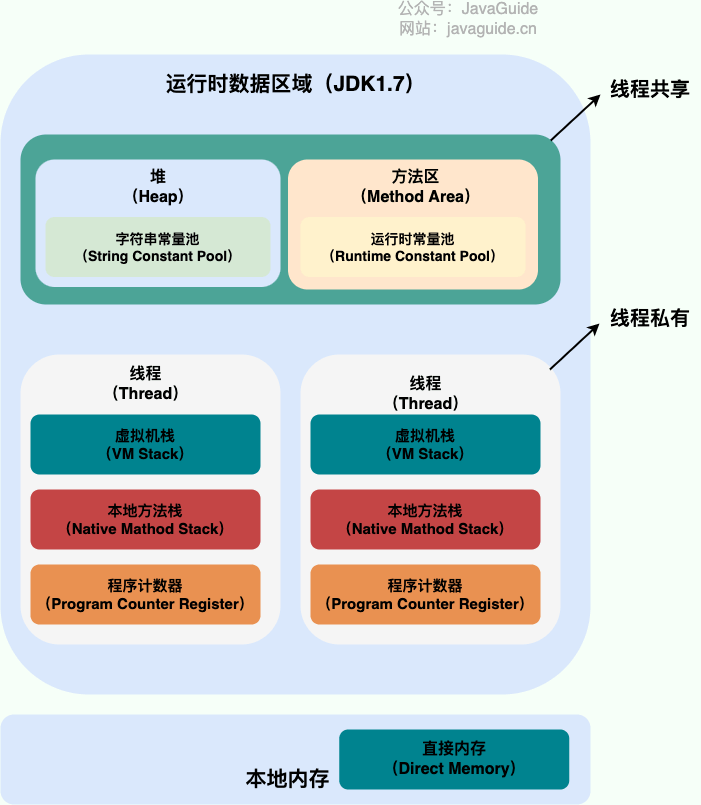

### JDK1.8
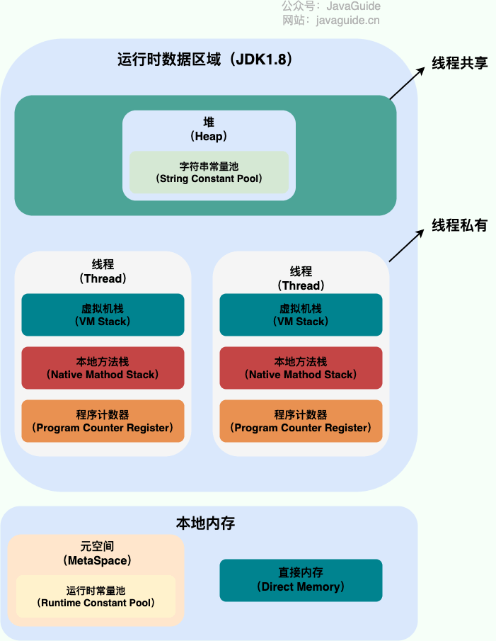

线程私有：程序计数器、虚拟机栈、本地方法栈
线程共享：堆、方法区、直接内存 (非运行时数据区的一部分)


## 一、 程序计数器
主要是充当线程执行字节码的信号指示器。
作用：
- 字节码解释器通过改变程序计数器来依次读取指令，从而实现代码的流程控制，如：顺序执行、选择、循环、异常处理。
- 在多线程的情况下，程序计数器用于记录当前线程执行的位置，从而当线程被切换回来的时候能够知道该线程上次运行到哪儿了。

注意：程序计数器是唯一一个不会出现 `OutOfMemoryError` 的内存区域，它的生命周期随着线程的创建而创建，随着线程的结束而死亡。

## 二、Java 虚拟机栈（简称栈）
生命周期和线程相同，随着线程的创建而创建，随着线程的死亡而死亡。

栈是是 JVM 运行时数据区域的一个核心，除了一些 Native 方法调用是通过本地方法栈实现的(后面会提到)，其他所有的 Java 方法调用都是通过栈来实现的（也需要和其他运行时数据区域比如程序计数器配合）。

方法调用的数据要通过栈帧来传递，每一个方法调用都有一个对应的栈帧**压入栈**，每一个方法调用结束都会有个栈帧被**弹出栈**。
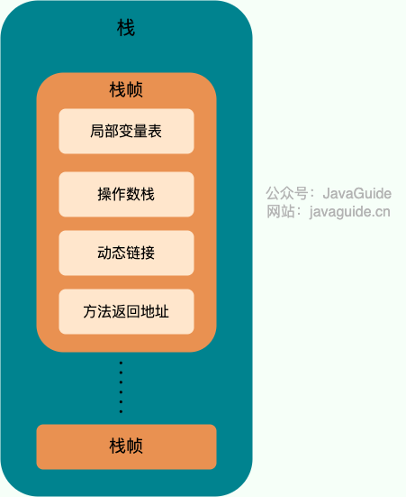
### 局部变量表
**局部变量表** 主要存放了编译期可知的各种数据类型（boolean、byte、char、short、int、float、long、double）、对象引用（reference 类型，它不同于对象本身，可能是一个指向对象起始地址的引用指针，也可能是指向一个代表对象的句柄（访问对象的代理）或其他与此对象相关的位置）。
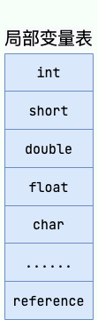
#### 局部变量和成员变量
局部变量在类的方法中或一个方法块中， 成员变量在一个类中。

#### 扩展-句柄概念
对象的句柄有两个关键方面：
1. **间接引用：** 句柄本身并不直接包含对象的数据，而是包含了一个指向对象数据的指针或引用。这个指针或引用称为句柄，它指向对象在内存中的实际位置。
2. **提供抽象：** 句柄提供了一种间接的、抽象的方式来访问对象。通过句柄，程序可以引用对象而无需直接了解对象的实际内存结构。这使得对象的实际布局可以在不影响程序的情况下进行修改。
使用对象句柄的主要优势包括：
- **动态内存管理：** 句柄可以使动态内存管理更加容易。对象的实际数据可以在堆上分配，并由句柄引用，使得对象的移动和释放变得相对简单。
    
- **安全性：** 句柄可以提供额外的安全性，因为它们可以用于检查对对象的访问权限。通过句柄，可以实现访问控制和保护对象免受非法访问。
    
- **实现垃圾回收：** 句柄可以帮助实现垃圾回收。当对象被移动或回收时，只需更新句柄而无需修改引用对象的所有地方。


### **操作数栈** 
主要作为方法调用的中转站使用，用于存放方法执行过程中产生的中间计算结果。另外，计算过程中产生的临时变量也会放在操作数栈中。

### **动态链接** 
主要服务一个方法需要调用其他方法的场景。Class 文件的常量池里保存有大量的符号引用，比如方法引用的符号引用。
当一个方法要调用其他方法，需要将常量池中指向方法的符号引用转化为其在内存地址中的直接引用。
动态链接的作用就是为了将符号引用转换为调用方法的直接引用，这个过程也被称为 **动态连接** 。
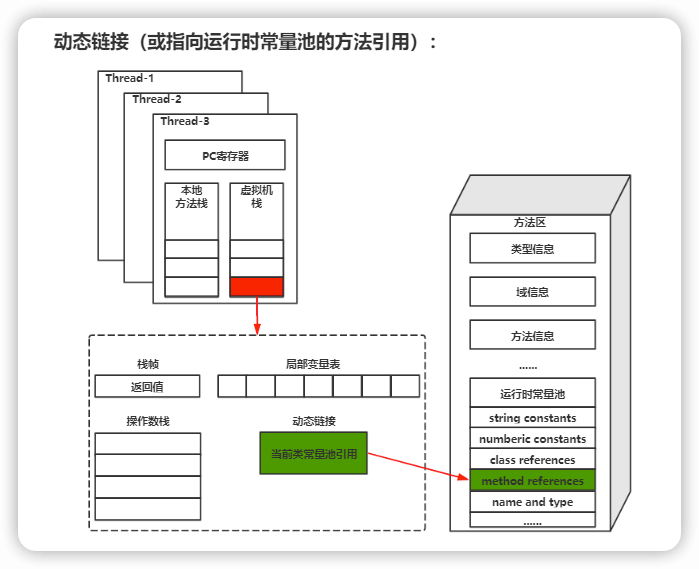
#### 符号引用
符号引用用来代表类、方法、字段等元素的名字，而不涉及具体的内存地址或偏移量。
在这个例子中，`String.class`、`str.length()` 和 `Integer.MAX_VALUE` 都是符号引用。这些引用表示对类名、方法名和字段名的抽象引用，不涉及具体的内存地址。

```
// 符号引用示例：引用类名、方法名、字段名等
public class SymbolicReferenceExample {
    public static void main(String[] args) {
        // 符号引用：引用类名
        Class<?> clazz = String.class;

        // 符号引用：引用方法名
        String str = "Hello, World!";
        int length = str.length();

        // 符号引用：引用字段名
        int value = Integer.MAX_VALUE;
    }
}

```


### 程序运行中栈可能会出现两种错误：
- **`StackOverFlowError`：** 若栈的内存大小不允许动态扩展，那么当线程请求栈的深度超过当前 Java 虚拟机栈的最大深度的时候，就抛出 `StackOverFlowError` 错误。
- **`OutOfMemoryError`：** 如果栈的内存大小可以动态扩展， 如果虚拟机在动态扩展栈时无法申请到足够的内存空间，则抛出`OutOfMemoryError`异常。
场景：
- 如果函数调用陷入无限循环的话，就会导致栈中被压入太多栈帧而占用太多空间，导致栈空间过深。那么当线程请求栈的深度超过当前 Java 虚拟机栈的最大深度的时候，就抛出 `StackOverFlowError` 错误。

### 栈帧的结束
	Java 方法有两种返回方式，一种是 return 语句正常返回，一种是抛出异常。
	不管哪种返回方式，都会导致栈帧被弹出。
	也就是说， 栈帧随着方法调用而创建，随着方法结束而销毁。
	无论方法正常完成还是异常完成都算作方法结束。


## 三、本地方法栈

**虚拟机栈为虚拟机执行 Java 方法 （也就是字节码）服务，而本地方法栈则为虚拟机使用到的 Native 方法服务。** 在 HotSpot 虚拟机中和 Java 虚拟机栈合二为一。

本地方法被执行的时候，在本地方法栈也会创建一个栈帧，用于存放该本地方法的局部变量表、操作数栈、动态链接、出口信息。

方法执行完毕后相应的栈帧也会出栈并释放内存空间，也会出现 `StackOverFlowError` 和 `OutOfMemoryError` 两种错误。


## 四、堆
**此内存区域的唯一目的就是存放对象实例，几乎所有的对象实例以及数组都在这里分配内存。**

Java 堆是垃圾收集器管理的主要区域，因此也被称作 **GC 堆（Garbage Collected Heap）**。从垃圾回收的角度，由于现在收集器基本都采用分代垃圾收集算法。

### 堆还能被细分成以下：

在 JDK 7 版本及 JDK 7 版本之前，堆内存被通常分为下面三部分：
1. 新生代内存(Young Generation)
2. 老生代(Old Generation)
3. 永久代(Permanent Generation)
Eden 区、两个 Survivor 区 S0 和 S1 都属于新生代，中间一层属于老年代，最下面一层属于永久代。

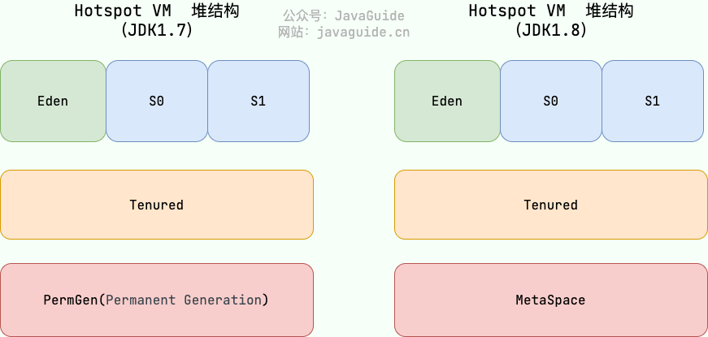

**JDK 8 版本之后 PermGen(永久代) 已被 Metaspace(元空间) 取代，元空间使用的是本地内存。** （详见方法区）

大部分情况，首先对象都会在 Eden 区域分配，
在第一次新生代垃圾回收后，如果对象还存活，则会进入 S0 或者 S1，并且对象的年龄还会加 1(Eden 区->Survivor 区后对象的初始年龄变为 1)，当它的年龄增加到一定程度（默认为 15 岁），就会被晋升到老年代中。

Hotspot 遍历所有对象时，按照年龄从小到大对其所占用的大小进行累积，当累积的某个对象年龄大小超过了 survivor 区的一半时，取这个年龄和 MaxTenuringThreshold 中更小的一个值，作为新的晋升年龄阈值。（超过了 survivor 区的一半时，它通常指的是 Survivor 空间中所有存活对象累计占用的内存量达到 Survivor 空间总容量的一半。）

对象晋升到老年代的年龄阈值，可以通过参数 `-XX:MaxTenuringThreshold` 来设置。

### 堆这里最容易出现的错误：
1. **`java.lang.OutOfMemoryError: GC Overhead Limit Exceeded`**：当 JVM 花太多时间执行垃圾回收并且只能回收很少的堆空间时，就会发生此错误。
2. **`java.lang.OutOfMemoryError: Java heap space`** :假如在创建新的对象时, 堆内存中的空间不足以存放新创建的对象, 就会引发此错误。(和配置的最大堆内存有关，且受制于物理内存大小。最大堆内存可通过`-Xmx`参数配置，若没有特别配置，将会使用默认值，详见：[Default Java 8 max heap sizeopen in new window](https://stackoverflow.com/questions/28272923/default-xmxsize-in-java-8-max-heap-size))

## 五、方法区

是 JVM 运行时数据区域的一块逻辑区域，是各个线程共享的内存区域。
在不同的虚拟机实现上，方法区的实现是不同的。方法区实际是一个抽象概念，它的具体实现就是永久代和元空间。

---
当虚拟机要使用一个类时，它需要读取并解析 Class 文件获取相关信息，再将信息存入到方法区。方法区会存储已被虚拟机加载的 **类信息、字段信息、方法信息、常量、静态变量、即时编译器编译后的代码缓存等数据**。

### 方法区和永久代以及元空间的关系

	类比Java 中接口和类的关系，类实现了接口。
	这里，类就可以看作是永久代和元空间，接口可以看作是方法区。
	也就是说永久代以及元空间是 HotSpot 虚拟机对虚拟机规范中方法区的两种实现方式。
	永久代是 JDK 1.8 之前的方法区实现，JDK 1.8 及以后方法区的实现变成了元空间。

### 为啥要舍弃永久代用元空间来替换？

- 整个永久代有一个 JVM 本身设置的固定大小上限，无法进行调整。元空间使用的是本地内存，受本机可用内存的限制。
- 元空间里面存放的是类的元数据，这样加载多少类的元数据就不由 永久代的参数`MaxPermSize` 控制了, 而由系统的实际可用空间来控制，这样能加载的类就更多了。
- 在 JDK8，合并 HotSpot 和 JRockit 的代码时, JRockit 从来没有一个叫永久代的东西, 合并之后就没有必要额外的设置这么一个永久代的地方了。

### **方法区常用参数有哪些？**
JDK 1.8 之前永久代还没被彻底移除的时候通常通过下面这些参数来调节方法区大小。

```
-XX:PermSize=N //方法区 (永久代) 初始大小
-XX:MaxPermSize=N //方法区 (永久代) 最大大小,超过这个值将会抛出 OutOfMemoryError 异常:java.lang.OutOfMemoryError: PermGen
```

相对而言，垃圾收集行为在这个区域是比较少出现的，但并非数据进入方法区后就“永久存在”了。

---

JDK 1.8 的时候，方法区（HotSpot 的永久代）被彻底移除了（JDK1.7 就已经开始了），取而代之是元空间，元空间使用的是本地内存。下面是一些常用参数：
```
-XX:MetaspaceSize=N //设置 Metaspace 的初始（和最小大小）
-XX:MaxMetaspaceSize=N //设置 Metaspace 的最大大小
```
与永久代很大的不同就是，如果不指定大小的话，随着更多类的创建，虚拟机会耗尽所有可用的系统内存。

## 六、运行时常量池

### 常量池概念：
Class 文件中除了有类的版本、字段、方法、接口等描述信息外，还有用于存放编译期生成的各种字面量（Literal）和符号引用（Symbolic Reference）的 **常量池表(Constant Pool Table)** 。

字面量是源代码中的固定值的表示法，即通过字面我们就能知道其值的含义。
字面量包括整数、浮点数和字符串字面量。常见的符号引用包括类符号引用、字段符号引用、方法符号引用、接口方法符号。
#### 字面量

```
// 字面量示例：直接使用具体的数值或字符串 
public class LiteralExample {     
	public static void main(String[] args) {
	         // 字面量：整数字面量         
	         int number = 42;          
	         // 字面量：字符串字面量
			 String str = "Hello, World!";
	  }
  }
```
在这个例子中，`42` 和 `"Hello, World!"` 都是字面量。字面量是直接表示数据的具体值，而不是引用。字面量在编码时就已经确定了其值，不需要进一步的解析或引用。

---
### 运行时常量池概念：
运行时常量池的功能类似于传统编程语言的符号表，尽管它包含了比典型符号表更广泛的数据。

既然运行时常量池是方法区的一部分，自然受到方法区内存的限制，当常量池无法再申请到内存时会抛出 `OutOfMemoryError` 错误。


## 七、字符串常量池

### 字符串常量池概念：

	字符串常量池 是 JVM 为了 提升性能 和 减少内存消耗 针对字符串（String 类）
	专门开辟的一块区域，主要目的是为了避免字符串的重复创建。

原理：
	`StringTable` 可以简单理解为一个固定大小的`HashTable` ，容量为 `StringTableSize`（可以通过 `-XX:StringTableSize` 参数来设置），保存的是字符串（key）和 字符串对象的引用（value）的映射关系，字符串对象的引用指向堆中的字符串对象。

JDK1.7 之前，字符串常量池存放在永久代。

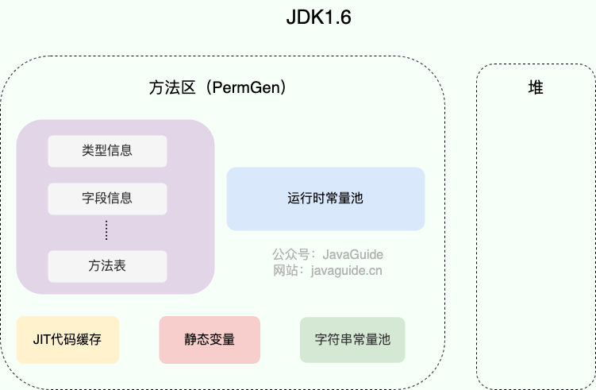
JDK1.7 字符串常量池和静态变量从永久代移动了 Java 堆中。

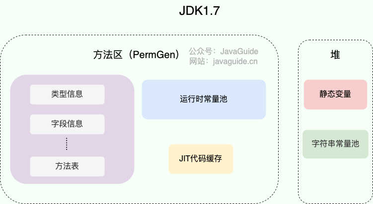

### **JDK 1.7 为什么要将字符串常量池移动到堆中？**

主要是因为永久代（方法区实现）的 GC 回收效率太低，只有在整堆收集 (Full GC)的时候才会被执行 GC。Java 程序中通常会有大量的被创建的字符串等待回收，将字符串常量池放到堆中，能够更高效及时地回收字符串内存。

---
> **运行时常量池、方法区、字符串常量池这些都是不随虚拟机实现而改变的逻辑概念，是公共且抽象的，Metaspace、Heap 是与具体某种虚拟机实现相关的物理概念，是私有且具体的。**
> [《深入理解 Java 虚拟机（第 3 版）》](https://github.com/fenixsoft/jvm_book)

## 八、直接内存

直接内存是一种特殊的内存缓冲区，并不在 Java 堆或方法区中分配的，而是通过 JNI 的方式在本地内存上分配的。

JNI（Java Native Interface）是Java编程语言的一项特性，允许Java代码与其他编程语言（主要是C和C++）进行交互。
JNI允许Java代码调用本地（native）方法，这些本地方法是用C或C++等语言编写的，并且允许本地方法访问和操作Java对象。

直接内存并不是虚拟机运行时数据区的一部分，也不是虚拟机规范中定义的内存区域，但是这部分内存也被频繁地使用。而且也可能导致 `OutOfMemoryError` 错误出现。

JDK1.4 中新加入的 **NIO（Non-Blocking I/O，也被称为 New I/O）**，引入了一种基于**通道（Channel）与缓存区（Buffer）的 I/O 方式，它可以直接使用 Native 函数库直接分配堆外内存，然后通过一个存储在 Java 堆中的 DirectByteBuffer 对象作为这块内存的引用进行操作。这样就能在一些场景中显著提高性能，因为**避免了在 Java 堆和 Native 堆之间来回复制数据。

直接内存的分配不会受到 Java 堆的限制，但是，既然是内存就会受到**本机总内存大小**以及**处理器寻址空间**的限制。


# GC机制
## 为什么要了解GC？

为了面对内存溢出、垃圾回收成为系统更高并发的瓶颈时，需要对这些'自动化'的技术进行必要的监控、调节。
## 为什么要了解堆空间的基本结构？
- Java 堆是垃圾收集器管理的主要区域
- Java堆自动内存管理机制是对 **对象内存** 的分配和回收。
- 其中自动内存管理最核心的就是对 **堆** 内存中的对象进行分配和回收。

主要分为JDK1.7和JDK1.8，JDK1.7及其之前，新生代，老年代，永久代。其中新生代包括Ed en和Survivor区（Survivor又分为S0，S1）。Tenured是老年代，PermGen永久代（permanent Generation）

## 内存回收和分配的流程（原则）

```
package com.example.bagu;  
  **
  GC回收Test
  添加VM option -> -XX:+PrintGCDetails
  *
public class GCTest {  
          public static void main(String[] args) {  
                    byte[] allocation1,allocation2;  
                      
                    allocation1 = new byte[28900*1024];  
                    allocation2 = new byte[2000*1024];  
  
          }  
}
```
- 大多数情况下，对象在新生代中 Eden 区分配。 
- 当 Eden 区没有足够空间进行分配时，虚拟机将发起一次 Minor GC。如果GC 期间虚拟机又发现 `allocation1` 无法存入 Survivor 空间，所以只好通过 **分配担保机制** 把新生代的对象提前转移到老年代中去，老年代上的空间足够存放 `allocation1`，所以不会出现 Full GC。
- 执行 Minor GC 后，后面分配的对象如果能够存在 Eden 区的话，还是会在 Eden 区分配内存。
- 大对象直接进入老年代是一种优化策略，旨在避免将大对象放入新生代，从而减少新生代的垃圾回收频率和成本。
- 虚拟机采用了分代收集的思想来管理内存，所以虚拟机会给每一个对象分配一个年龄计数器，每经过一次Minor GC，年龄+1，当它的年龄增加到一定程度（默认为 15 岁），就会被晋升到老年代中。（如果经过Minor GC 进入survivor区，年龄会重置为 0）
- 

---

### 主要进行 gc 的区域
- 部分收集 (Partial GC)：
	1. 新生代GC（MinorGC/_Young_GC）
	2. 老年代GC（Major GC / Old GC）
	3. 混合收集（Mixed GC）：对整个新生代和部分老年代进行垃圾收集。
- 整堆收集 (Full GC)：收集整个 Java 堆和方法区。

### 空间分配担保机制
空间分配担保是为了确保在 Minor GC 之前老年代本身还有容纳新生代所有对象的剩余空间。
—— 见《深入理解 Java 虚拟机》第三章


## 为什么要了解死亡对象判断方法？
 - 堆中几乎放着所有的对象实例，对堆垃圾回收前的第一步就是要判断哪些对象已经死亡（即不能再被任何途径使用的对象）。
### 引用计数法
给对象中添加一个引用计数器：
- 每当有一个地方引用它，计数器就加 1；
- 当引用失效，计数器就减 1；
- 任何时候计数器为 0 的对象就是不可能再被使用的。

**这个方法实现简单，效率高，但是目前主流的虚拟机中并没有选择这个算法来管理内存，其最主要的原因是它很难解决对象之间循环引用的问题。**
（例如创建一个类，方法中创建两个对象实例，互相引用对方，再置为null）

### 可达性分析算法
算法的基本思想就是通过“**GC Roots**”的对象作为根起点，查找引用关系链，节点走过的路径叫引用链。（当一个对象到 GC Roots 没有任何引用链相连的话，则证明此对象是不可用的，需要被回收。）

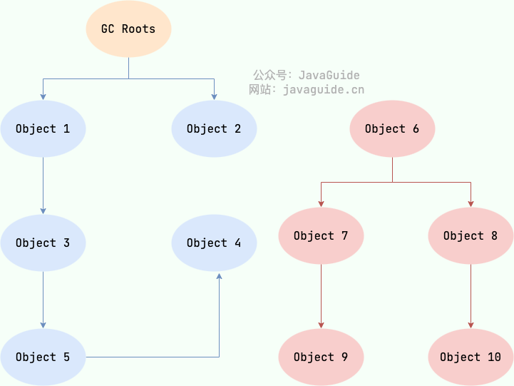

哪些对象能作为GCRoots的应用？
- 虚拟机栈(栈帧中的局部变量表)中引用的对象
- 本地方法栈(Native 方法)中引用的对象
- 方法区中类静态属性引用的对象
- 方法区中常量引用的对象
- 所有被同步锁持有的对象
- JNI（Java Native Interface）引用的对象
### **对象可以被回收，就代表一定会被回收吗？**
 - 即使在可达性分析法中不可达的对象，也并非是“非死不可”的，这时候它们暂时处于“缓刑阶段”，要真正宣告一个对象死亡，至少要经历两次标记过程；
- 可达性分析法中不可达的对象被第一次标记并且进行一次筛选，筛选的条件是此对象是否有必要执行 `finalize` 方法。 当对象没有覆盖 `finalize` 方法，或 `finalize` 方法已经被虚拟机调用过时，虚拟机将这两种情况视为没有必要执行。
- 被判定为需要执行的对象将会被放在一个队列中进行第二次标记，除非这个对象与引用链上的任何一个对象建立关联，否则就会被真的回收。

### 引用类型总结

#### 强引用
以前我们使用的大部分引用实际上都是强引用，这是使用最普遍的引用。
如果一个对象具有强引用，那就类似于**必不可少的生活用品**，垃圾回收器绝不会回收它。
当内存空间不足，Java 虚拟机宁愿抛出 OutOfMemoryError 错误，使程序异常终止，也不会靠随意回收具有强引用的对象来解决内存不足问题。
```
1. `Object obj = new Object(); // 强引用`
```
#### 软引用
如果一个对象只具有软引用，那就类似于**可有可无的生活用品**。如果内存空间足够，垃圾回收器就不会回收它，如果内存空间不足了，就会回收这些对象的内存。只要垃圾回收器没有回收它，该对象就可以被程序使用。软引用可用来实现内存敏感的高速缓存。

软引用可以和一个引用队列（ReferenceQueue）联合使用，如果软引用所引用的对象被垃圾回收，JAVA 虚拟机就会把这个软引用加入到与之关联的引用队列中。
```java
1. `SoftReference<Object> softRef = new SoftReference<>(new Object()); // 软引用`
```
#### 弱引用（**PhantomReference**）
如果一个对象只具有弱引用，那就类似于**可有可无的生活用品**。
弱引用与软引用的区别在于：**只具有弱引用的对象拥有更短暂的生命周期**。在垃圾回收器线程扫描它所管辖的内存区域的过程中，**一旦发现了只具有弱引用的对象，不管当前内存空间足够与否，都会回收它的内存。**
不过，由于垃圾回收器是一个优先级很低的线程， 因此不一定会很快发现那些只具有弱引用的对象。
弱引用可以和一个引用队列（ReferenceQueue）联合使用，如果弱引用所引用的对象被垃圾回收，Java 虚拟机就会把这个弱引用加入到与之关联的引用队列中。

```java
1. `WeakReference<Object> weakRef = new WeakReference<>(new Object()); // 弱引用`
```
#### 虚引用
"虚引用"顾名思义，就是形同虚设，与其他几种引用都不同，虚引用**并不会决定对象的生命周期**。如果一个对象仅持有虚引用，那么它就和没有任何引用一样，在任何时候都可能被垃圾回收。

**虚引用主要用来跟踪对象被垃圾回收的活动**。


**虚引用与软引用和弱引用的一个区别在于：** 虚引用必须和引用队列（ReferenceQueue）联合使用。
当垃圾回收器准备回收一个对象时，如果发现它还有虚引用，就会在回收对象的内存之前，把这个虚引用加入到与之关联的引用队列中。程序可以通过判断引用队列中是否已经加入了虚引用，来了解被引用的对象是否将要被垃圾回收。程序如果发现某个虚引用已经被加入到引用队列，那么就可以在所引用的对象的内存被回收之前采取必要的行动。

- 1. **清理资源：** 虚引用的主要作用之一是允许程序在对象被垃圾回收之前进行一些资源清理操作。例如，关闭文件、释放网络连接、释放锁等。这有助于确保程序能够及时释放和回收占用的系统资源。
- 2. **解除关联：** 在虚引用被加入引用队列之前，程序可以执行解除虚引用与实际对象之间的关联。这有助于防止在对象被回收之后再次访问虚引用引用的对象。
- 3. **记录日志：** 在虚引用被加入引用队列时，程序可以记录一些日志信息，以便于跟踪和调试。这样可以帮助开发人员了解对象生命周期和垃圾回收的情况。
- 4. **执行特定业务逻辑：** 根据应用程序的需求，程序可以执行一些特定的业务逻辑。这可能涉及触发其他事件、通知其他模块或执行其他与应用程序逻辑相关的操作。

特别注意，在程序设计中一般很少使用弱引用与虚引用，使用软引用的情况较多，这是因为**软引用可以加速 JVM 对垃圾内存的回收速度，可以维护系统的运行安全，防止内存溢出（OutOfMemory）等问题的产生**。

```java
ReferenceQueue<Object> queue = new ReferenceQueue<>(); PhantomReference<Object> phantomRef = new PhantomReference<>(new Object(), queue); // 虚引用
```

### 如何判断一个常量是废弃常量？

> 1. **JDK1.7 之前运行时常量池逻辑包含字符串常量池存  放在方法区, 此时 hotspot 虚拟机对方法区的实现为永久代**
> 2. **JDK1.7 字符串常量池被从方法区拿到了堆中, 这里没有提到运行时常量池,也就是说字符串常量池被单独拿到堆,运行时常量池剩下的东西还在方法区, 也就是 hotspot 中的永久代** 。
> 3. **JDK1.8 hotspot 移除了永久代用元空间(Metaspace)取而代之, 这时候字符串常量池还在堆, 运行时常量池还在方法区, 只不过方法区的实现从永久代变成了元空间(Metaspace)**

假如在字符串常量池中存在字符串 "abc"，如果当前没有任何 String 对象引用该字符串常量的话，就说明常量 "abc" 就是废弃常量，如果这时发生内存回收的话而且有必要的话，"abc" 就会被系统清理出常量池了。

### 如何判断一个类是无用的类？

方法区主要回收的是无用的类，那么如何判断一个类是无用的类的呢？

判定一个常量是否是“废弃常量”比较简单，而要判定一个类是否是“无用的类”的条件则相对苛刻许多。类需要同时满足下面 3 个条件才能算是 **“无用的类”**：

- 该类所有的实例都已经被回收，也就是 Java 堆中不存在该类的任何实例。
- 加载该类的 `ClassLoader` 已经被回收。 （类加载器被回收）
- 该类对应的 `java.lang.Class` 对象没有在任何地方被引用，无法在任何地方通过反射访问该类的方法。

虚拟机可以对满足上述 3 个条件的无用类进行回收，这里说的仅仅是“可以”，而并不是和对象一样不使用了就会必然被回收。


---
## 垃圾回收算法

### 标记-清除算法
标记-清除（Mark-and-Sweep）算法分为“标记（Mark）”和“清除（Sweep）”阶段：
 先标记出所有不需要回收的对象，在标记完成后统一回收掉所有没有被标记的对象。
（最基础的收集算法，此后的算法都是在其基础上优化的）

缺点：
1. **效率问题**：标记和清除两个过程效率都不高。
2. **空间问题**：标记清除后会产生大量不连续的内存碎片。
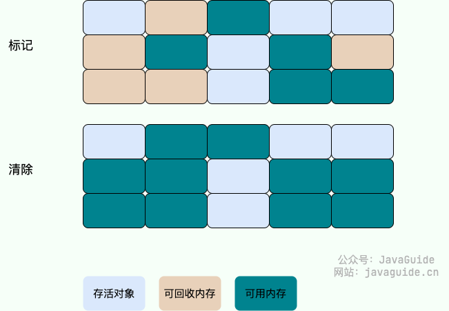

### 复制算法

为了解决标记-清除算法的效率和内存碎片问题

它可以将内存分为大小相同的两块，每次使用其中的一块。当这一块的内存使用完后，就将还存活的对象复制到另一块去，然后再把使用的空间一次清理掉。这样就使每次的内存回收都是对内存区间的一半进行回收。

缺点：
- **可用内存变小**：可用内存缩小为原来的一半。
- **不适合老年代**：如果存活对象数量比较大，复制性能会变得很差。

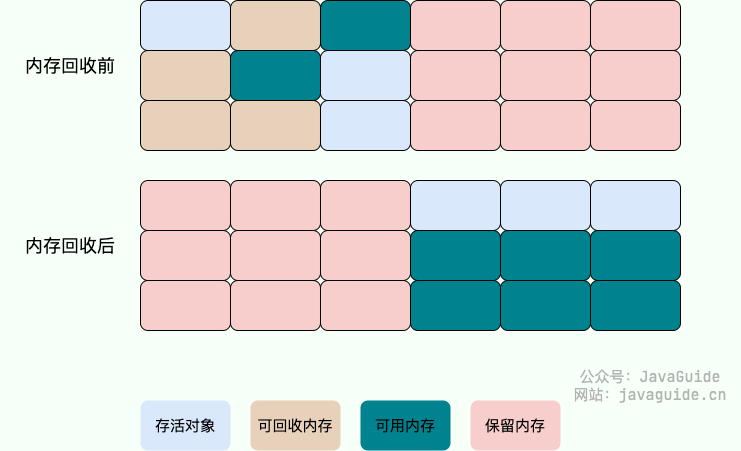

### 标记-整理算法
标记-整理（Mark-and-Compact）算法是根据老年代的特点提出的一种标记算法，标记过程仍然与“标记-清除”算法一样，但后续步骤不是直接对可回收对象回收，而是让所有存活的对象向一端移动，然后直接清理掉端边界以外的内存。

由于多了整理这一步，因此效率也不高，适合**老年代**这种垃圾回收频率不是很高的场景。
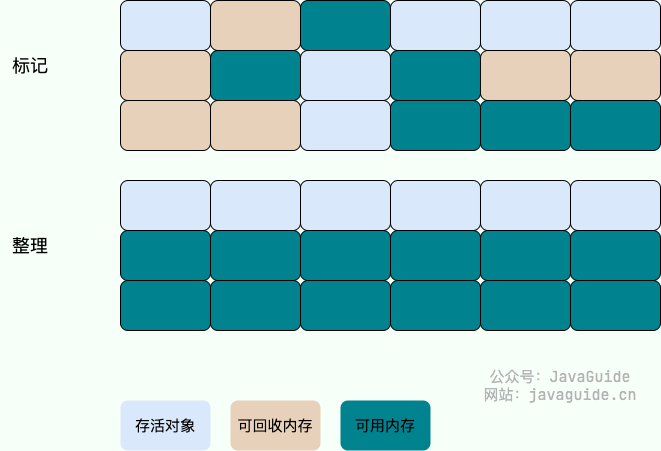
### 分代收集算法

 当前虚拟机的垃圾收集都采用分代收集算法，这种算法没有什么新的思想，只是根据对象存活周期的不同将内存分为几块。一般将 Java 堆分为新生代和老年代，这样我们就可以根据各个年代的特点选择合适的垃圾收集算法。
### HotSpot 为什么要分为新生代和老年代？
是为了更有效地管理内存和提高垃圾回收的性能
这种分代的设计是基于以下考虑：
1. **对象生命周期分布：** 观察发现，大多数对象的生命周期都比较短暂，即它们在被创建后很快就不再被引用。因此，将内存空间划分为新生代和老年代，可以更好地适应不同对象的生命周期。
 
2. **不同的垃圾回收策略：**    
- **新生代：** 由于新生代中的对象生命周期短暂，HotSpot 使用了复制算法，将新生代划分为 Eden 空间和两个 Survivor 空间。对象首先在 Eden 空间分配，经过一轮或多轮的垃圾回收后，仍然存活的对象会被移到 Survivor 空间，直到最终被晋升到老年代。
- **老年代：** 由于老年代中的对象生命周期较长，采用标记-清理或标记-整理算法进行垃圾回收。
3. **避免频繁垃圾回收：** 如果只有一个堆，每次进行垃圾回收时都需要遍历整个堆空间，这样的开销将会很大。通过将内存划分为新生代和老年代，可以减小每次垃圾回收的范围，提高垃圾回收的效率。
4. **不同的回收频率：** 由于新生代中的对象更容易成为垃圾，因此垃圾回收发生得更频繁。而老年代中的对象垃圾回收则相对较少，因为老年代中的对象生命周期较长，不容易成为垃圾。
5. 总体而言，新生代和老年代的划分有助于提高内存管理的效率，通过不同的垃圾回收策略适应不同对象的生命周期，避免频繁的全堆扫描，提高垃圾回收的性能。
---
## [垃圾回收器](https://javaguide.cn/java/jvm/jvm-garbage-collection.html#%E5%9E%83%E5%9C%BE%E6%94%B6%E9%9B%86%E5%99%A8)

JDK 默认垃圾收集器（使用 `java -XX:+PrintCommandLineFlags -version` 命令查看）：

- JDK 8：Parallel Scavenge（新生代）+ Parallel Old（老年代）
- JDK 9 ~ JDK20: G1
### Serial 收集器

Serial（串行）收集器是最基本、历史最悠久的垃圾收集器了。大家看名字就知道这个收集器是一个单线程收集器了。它的 **“单线程”** 的意义不仅仅意味着它只会使用一条垃圾收集线程去完成垃圾收集工作，更重要的是它在进行垃圾收集工作的时候必须暂停其他所有的工作线程（ **"Stop The World"** ），直到它收集结束。

**收集算法**：
	**新生代采用标记-复制算法，老年代采用标记-整理算法。**

**优点**：
 - 它**简单而高效（与其他收集器的单线程相比）**。
 - Serial 收集器由于没有线程交互的开销，自然可以获得很高的单线程收集效率。
 **场景**：
 - 在 Client 模式下的虚拟机来说是个不错的选择。

### ParNew 收集器
ParNew 收集器其实就是 Serial 收集器的多线程版本，除了使用多线程进行垃圾收集外，其余行为（控制参数、收集算法、回收策略等等）和 Serial 收集器完全一样。

**收集算法**：（存在Stop The World）
	**新生代采用标记-复制算法，老年代采用标记-整理算法。**

场景：
- 场景在 Server 模式下的虚拟机的首要选择

### Parallel Scavenge 收集器｜JDK1.8 默认收集器
```
-XX:+UseParallelGC

    使用 Parallel 收集器+ 老年代串行

-XX:+UseParallelOldGC

    使用 Parallel 收集器+ 老年代并行

```
所谓吞吐量就是 CPU 中用于运行用户代码的时间与 CPU 总消耗时间的比值。

**收集算法**：（存在Stop The World）
	**新生代采用标记-复制算法，老年代采用标记-整理算法。**

**优点**：
- Parallel Scavenge 收集器关注点是吞吐量（高效率的利用 CPU）。
- Parallel Scavenge 收集器提供了很多参数供用户找到最合适的停顿时间或最大吞吐量。
- 如果对于收集器运作不太了解，手工优化存在困难的时候，使用 Parallel Scavenge 收集器配合自适应调节策略，把内存管理优化交给虚拟机去完成也是一个不错的选择。

**并行和并发概念补充：**
- "并发"强调的是任务的交替执行，可能是在单处理器上通过快速切换实现；
- 而"并行"强调的是任务的同时执行，通常需要多个处理器。在实际应用中，"并发"和"并行"可能同时存在，多任务通过并发执行，而每个任务内部又可以通过并行的方式来提高计算速度。


使用 `java -XX:+PrintCommandLineFlags -version` 命令查看

### CMS 收集器

**CMS（Concurrent Mark Sweep）收集器是一种以获取最短回收停顿时间为目标的收集器。它非常符合在注重用户体验的应用上使用。**

**CMS（Concurrent Mark Sweep）收集器是 HotSpot 虚拟机第一款真正意义上的并发收集器，它第一次实现了让垃圾收集线程与用户线程（基本上）同时工作。**

- **初始标记：** 暂停所有的其他线程，并记录下直接与 root 相连的对象，速度很快 ；
- **并发标记：** 同时开启 GC 和用户线程，用一个闭包结构去记录可达对象。但在这个阶段结束，这个闭包结构并不能保证包含当前所有的可达对象。因为用户线程可能会不断的更新引用域，所以 GC 线程无法保证 可达性分析的实时性。所以这个算法里会跟踪记录这些发生引用更新的地方。
- **重新标记：** 重新标记阶段就是为了修正并发标记期间因为用户程序继续运行而导致标记产生变动的那一部分对象的标记记录，这个阶段的停顿时间一般会比初始标记阶段的时间稍长，远远比并发标记阶段时间短。
- **并发清除：** 开启用户线程，同时 GC 线程开始对未标记的区域做清扫。


收集算法：
	**标记-清除**算法

优点：
	**并发收集、低停顿**。

缺点：
- **对 CPU 资源敏感；**
- **无法处理浮动垃圾；**
- **它使用的回收算法-“标记-清除”算法会导致收集结束时会有大量空间碎片产生。**

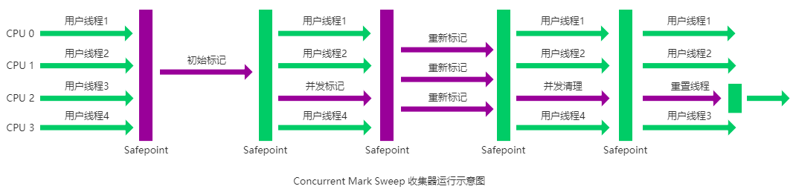


 
### G1收集器 | JDK9 默认收集器

**G1 (Garbage-First) 是一款面向服务器的垃圾收集器,主要针对配备多颗处理器及大容量内存的机器. 以极高概率满足 GC 停顿时间要求的同时,还具备高吞吐量性能特征.**

**G1 收集器在后台维护了一个优先列表，每次根据允许的收集时间，优先选择回收价值最大的 Region(-> 区域 | 这也就是它的名字 Garbage-First 的由来)** 。
这种使用 Region 划分内存空间以及有优先级的区域回收方式，保证了 G1 收集器在有限时间内可以尽可能高的收集效率（把内存化整为零）。


特点：

- **并行与并发**：G1 能充分利用 CPU、多核环境下的硬件优势，使用多个 CPU（CPU 或者 CPU 核心）来缩短 Stop-The-World 停顿时间。部分其他收集器原本需要停顿 Java 线程执行的 GC 动作，G1 收集器仍然可以通过并发的方式让 java 程序继续执行。
- **分代收集**：虽然 G1 可以不需要其他收集器配合就能独立管理整个 GC 堆，但是还是保留了分代的概念。
- **空间整合**：与 CMS 的“标记-清除”算法不同，G1 从整体来看是基于“标记-整理”算法实现的收集器；从局部上来看是基于“标记-复制”算法实现的。
- **可预测的停顿**：这是 G1 相对于 CMS 的另一个大优势，降低停顿时间是 G1 和 CMS 共同的关注点，但 G1 除了追求低停顿外，还能建立可预测的停顿时间模型，能让使用者明确指定在一个长度为 M 毫秒的时间片段内，消耗在垃圾收集上的时间不得超过 N 毫秒。


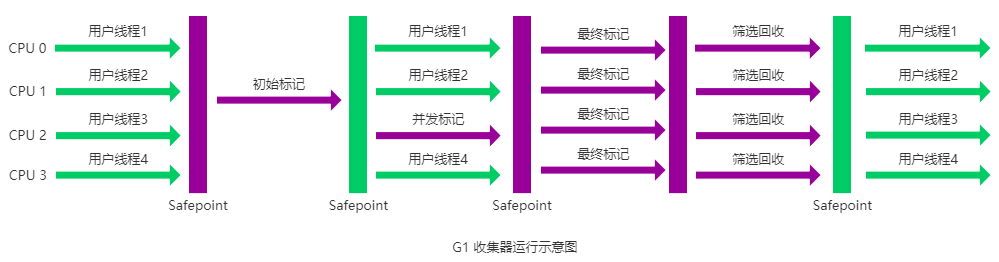


### ZGC 收集器 ｜ Java15


---
# 类加载/类加载器
## 类的生命周期
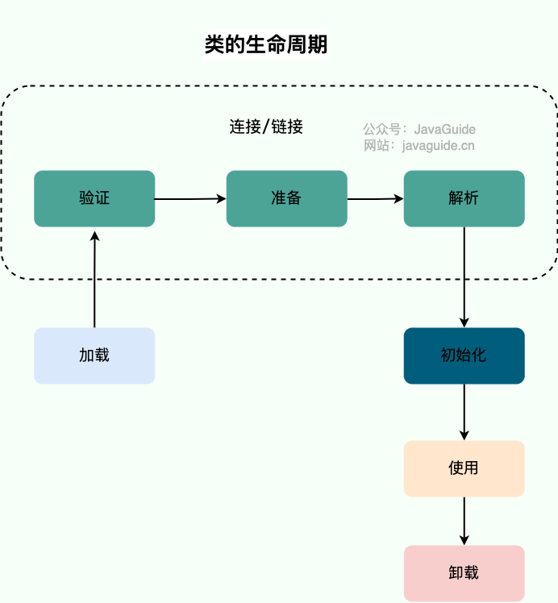
## 类加载过程
- 加载
- 连接（验证、准备、解析）
- 初始化
## 类加载器

### 概念
- 实现于加载这一步
- 是一个负责加载类的对象（ClassLoader）
- 每一个Java类都有一个引用指向加载它的ClassLoader
- 数组类不是通过ClassLoader生成的（数组类没有对应的二进制码流），而是由JVM直接生成的。 ｜数组对象是在程序运行时动态创建的，并且数组的元素也是在运行时动态分配的内存空间。
**类加载器的主要作用就是加载 Java 类的字节码（ `.class` 文件）到 JVM 中（在内存中生成一个代表该类的 `Class` 对象）。** 字节码可以是 Java 源程序（`.java`文件）经过 `javac` 编译得来，也可以是通过工具动态生成或者通过网络下载得来。

其实除了加载类之外，类加载器还可以加载 Java 应用所需的资源如文本、图像、配置文件、视频等等文件资源。本文只讨论其核心功能：加载类。
 
### 类加载器加载规则：
- 根据需要去动态加载，不会一次性的去加载所有的类；而是用到哪些类就去动态的加载，对内存友好。
- 对于已经加载的类会被放在 `ClassLoader` 中。
- 在类加载的时候，系统会首先判断当前类是否被加载过。已经被加载的类会直接返回，否则才会尝试加载。也就是说，对于一个类加载器来说，相同二进制名称的类只会被加载一次。

### 类加载器的类型

JVM 中内置了三个重要的 `ClassLoader`：

1. **`BootstrapClassLoader`(启动类加载器)**：最顶层的加载类，由 C++实现，通常表示为 null，并且没有父级，主要用来加载 JDK 内部的核心类库（ `%JAVA_HOME%/lib`目录下的 `rt.jar`、`resources.jar`、`charsets.jar`等 jar 包和类）以及被 `-Xbootclasspath`参数指定的路径下的所有类。
2. **`ExtensionClassLoader`(扩展类加载器)**：主要负责加载 `%JRE_HOME%/lib/ext` 目录下的 jar 包和类以及被 `java.ext.dirs` 系统变量所指定的路径下的所有类。
3. **`AppClassLoader`(应用程序类加载器)**：面向我们用户的加载器，负责加载当前应用 classpath 下的所有 jar 包和类。

	 除了这三种类加载器之外，用户还可以加入自定义的类加载器来进行拓展，以满足自己的特殊需求。就比如说，我们可以对 Java 类的字节码（ `.class` 文件）进行加密，加载时再利用自定义的类加载器对其解密。
 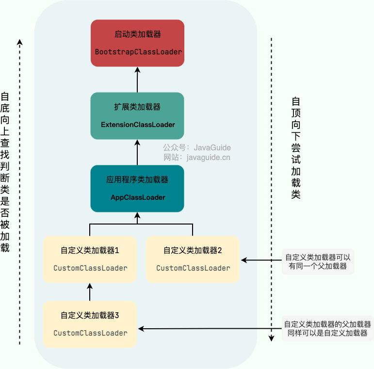
除了 `BootstrapClassLoader` 是 JVM 自身的一部分之外，其他所有的类加载器都是在 JVM 外部实现的，并且全都继承自 `ClassLoader`抽象类。
- 这样做的好处是用户可以自定义类加载器，以便让应用程序自己决定如何去获取所需的类。
- 每个 `ClassLoader` 可以通过`getParent()`获取其父 `ClassLoader`，如果获取到 `ClassLoader` 为`null`的话，那么该类是通过 `BootstrapClassLoader` 加载的。
（**为什么 获取到 `ClassLoader` 为`null`就是 `BootstrapClassLoader` 加载的呢？** 这是因为`BootstrapClassLoader` 由 C++ 实现，由于这个 C++ 实现的类加载器在 Java 中是没有与之对应的类的，所以拿到的结果是 null。）

```java
public class PrintClassLoaderTree {

    public static void main(String[] args) {

        ClassLoader classLoader = PrintClassLoaderTree.class.getClassLoader();

        StringBuilder split = new StringBuilder("|--");
        boolean needContinue = true;
        while (needContinue){
            System.out.println(split.toString() + classLoader);
            if(classLoader == null){
                needContinue = false;
            }else{
                classLoader = classLoader.getParent();
                split.insert(0, "\t");
            }
        }
    }

}

```
result：（JDK8）
|--sun.misc.Launcher$AppClassLoader@18b4aac2 
|--sun.misc.Launcher$ExtClassLoader@53bd815b 
|--null
结论：
- 编写的 Java 类 `PrintClassLoaderTree` 的 `ClassLoader` 是`AppClassLoader`；
- `AppClassLoader`的父 `ClassLoader` 是`ExtClassLoader`；
- `ExtClassLoader`的父`ClassLoader`是`Bootstrap ClassLoader`，因此输出结果为 null。

### 自定义类加载器
- 自定义一个ClassLoader需要去继承ClassLoader的抽象类。

`ClassLoader` 类有两个关键的方法：
- loadClass：`protected Class loadClass(String name, boolean resolve)`：加载指定二进制名称的类，实现了双亲委派机制 。`name` 为类的二进制名称，`resolve` 如果为 true，在加载时调用 `resolveClass(Class<?> c)` 方法解析该类。
- findClass：`protected Class findClass(String name)`：根据类的二进制名称来查找类，默认实现是空方法。

	如果我们不想打破双亲委派模型，就重写 `ClassLoader` 类中的 `findClass()` 方法即可，无法被父类加载器加载的类最终会通过这个方法被加载。
	但是，如果想打破双亲委派模型则需要重写 `loadClass()` 方法。

## 扩展
#### 类加载器中的类文件：
- **`rt.jar`**：rt 代表“RunTime”，`rt.jar`是 Java 基础类库，包含 Java doc 里面看到的所有的类的类文件。也就是说，我们常用内置库 `java.xxx.*`都在里面，比如`java.util.*`、`java.io.*`、`java.nio.*`、`java.lang.*`、`java.sql.*`、`java.math.*`。

#### Java9中的变动：
- Java 9 引入了模块系统，并且略微更改了上述的类加载器。扩展类加载器被改名为平台类加载器（platform class loader）。Java SE 中除了少数几个关键模块，比如说 `java.base` 是由启动类加载器加载之外，其他的模块均由平台类加载器所加载。


## 双亲委派模型

概念：
- `ClassLoader` 类使用委托模型来搜索类和资源。
- 双亲委派模型要求除了顶层的启动类加载器外，其余的类加载器都应有自己的父类加载器。
- `ClassLoader` 实例会在试图亲自查找类或资源之前，将搜索类或资源的任务委托给其父类加载器。
 
下图展示的各种类加载器之间的层次关系被称为类加载器的“**双亲委派模型(Parents Delegation Model)**”。
 

另外，类加载器之间的父子关系一般不是以继承的关系来实现的，而是通常使用组合关系来复用父加载器的代码。

```java
public abstract class ClassLoader {
  ...
  // 组合
  private final ClassLoader parent;
  protected ClassLoader(ClassLoader parent) {
       this(checkCreateClassLoader(), parent);
  }
  ...
}
```

在面向对象编程中，有一条非常经典的设计原则：**组合优于继承，多用组合少用继承。**

### 双亲委派模型的执行流程 ｜ 重要
每当一个类加载器接收到加载请求时，他会先将请求转发给负累的加载器。父类加载器找不到所请求的类时，该类加载器才会尝试加载。

执行流程：
- 类加载时，系统会先判断当前类是否被加载过。已经被加载的类会被直接返回，否则会尝试加载（每个父类加载器都会尝试这个流程）。
- 类加载器进行类加载的时候，先由父类去加载这个类，而是把这个请求委派给父类加载器去完成（调用父类加载器的 LoadClass（）方法加载）。这样操作，所有的请求最终都会回到顶层的启动加载器 BootStrapClassLoader 中；
- 只有当父类加载器找不到这个类，子类加载器才会去尝试进行加载（调用自己的 findClass（）方法进行加载类）。
- 如果自类也无法加载这个类，就会抛出 ClassNotFoundException 异常。
#### **JVM 判定两个 Java 类是否相同的具体规则**：
JVM 不仅要看类的全名是否相同，还要看加载此类的类加载器是否一样。只有两者都相同的情况，才认为两个类是相同的。即使两个类来源于同一个 `Class` 文件，被同一个虚拟机加载，只要加载它们的类加载器不同，那这两个类就必定不相同。

###  双亲委派模型的好处

双亲委派模型保证了 Java 程序的稳定运行，可以避免类的重复加载（JVM 区分不同类的方式不仅仅根据类名，相同的类文件被不同的类加载器加载产生的是两个不同的类），也保证了 Java 的核心 API 不被篡改。

如果没有使用双亲委派模型，而是每个类加载器加载自己的话就会出现一些问题，比如我们编写一个称为 `java.lang.Object` 类的话，那么程序运行的时候，系统就会出现两个不同的 `Object` 类。双亲委派模型可以保证加载的是 JRE 里的那个 `Object` 类，而不是你写的 `Object` 类。这是因为 `AppClassLoader` 在加载你的 `Object` 类时，会委托给 `ExtClassLoader` 去加载，而 `ExtClassLoader` 又会委托给 `BootstrapClassLoader`，`BootstrapClassLoader` 发现自己已经加载过了 `Object` 类，会直接返回，不会去加载你写的 `Object` 类。
 
### [打破双亲委派模型方法](https://javaguide.cn/java/jvm/classloader.html#%E5%8F%8C%E4%BA%B2%E5%A7%94%E6%B4%BE%E6%A8%A1%E5%9E%8B%E7%9A%84%E5%A5%BD%E5%A4%84)

重写 `loadClass()`方法之后，我们就可以改变传统双亲委派模型的执行流程。例如，子类加载器可以在委派给父类加载器之前，先自己尝试加载这个类，或者在父类加载器返回之后，再尝试从其他地方加载这个类。具体的规则由我们自己实现，根据项目需求定制化。
r


## [Java 对象的创建过程](https://javaguide.cn/java/jvm/memory-area.html#%E5%AF%B9%E8%B1%A1%E7%9A%84%E5%88%9B%E5%BB%BA)
1. 类加载检查
2. 分配内存
3. 初始化零值
4. 设置对象头
5. 执行init方法


#  **常用的Jvm参数**

-XX:+PrintGCDetails ｜ 用于在控制台输出详细的垃圾收集信息。

-XX:MaxTenuringThreshold ｜ 设置晋升到老年代的年龄。
（`-XX:MaxTenuringThreshold=threshold`这里有个说明
> 
> **Sets the maximum tenuring threshold for use in adaptive GC sizing. The largest value is 15. The default value is 15 for the parallel (throughput) collector, and 6 for the CMS collector.默认晋升年龄并不都是 15，这个是要区分垃圾收集器的，CMS 就是 6.**
> ）


---
# 扩展
## JVM的模式
Java虚拟机（JVM）在运行时可以选择不同的模式以适应不同的场景和需求。除了Client模式，还有Server模式。这两种模式主要影响了JVM的启动和运行时的优化。
1. **Client 模式：**
    
    - **特点：** 适用于客户端应用程序，例如图形用户界面（GUI）应用。
    - **优势：** 启动速度较快，占用的内存较少。
    - **缺点：** 优化程度相对较低，适合短时间运行的应用。
    
    在Client模式下，JVM使用解释器执行字节码，以便更快地启动应用程序。JIT编译器会在运行时逐渐将热点代码编译成本地机器代码，提高性能。
    
    在Java 8及之前的版本中，Client模式是默认模式。
2. **Server 模式：**
    
    - **特点：** 适用于服务器端应用程序，如Web应用。
    - **优势：** 启动速度相对较慢，但在长时间运行的情况下，性能更好。
    - **缺点：** 占用的内存较多。
    
    在Server模式下，JVM使用更高级别的优化技术，包括更多的即时编译（JIT）编译，以提高长时间运行应用程序的性能。Server模式下会有更多的优化，因此对于长时间运行的服务端应用更为适用。
    
    在Java 9及之后的版本中，Server模式成为了默认模式。

可以通过在Java启动命令中添加选项来选择使用哪种模式，例如：
- 使用Client模式：`java -client -jar YourApplication.jar`
- 使用Server模式：`java -server -jar YourApplication.jar`

## JIT


## 逃逸分析
