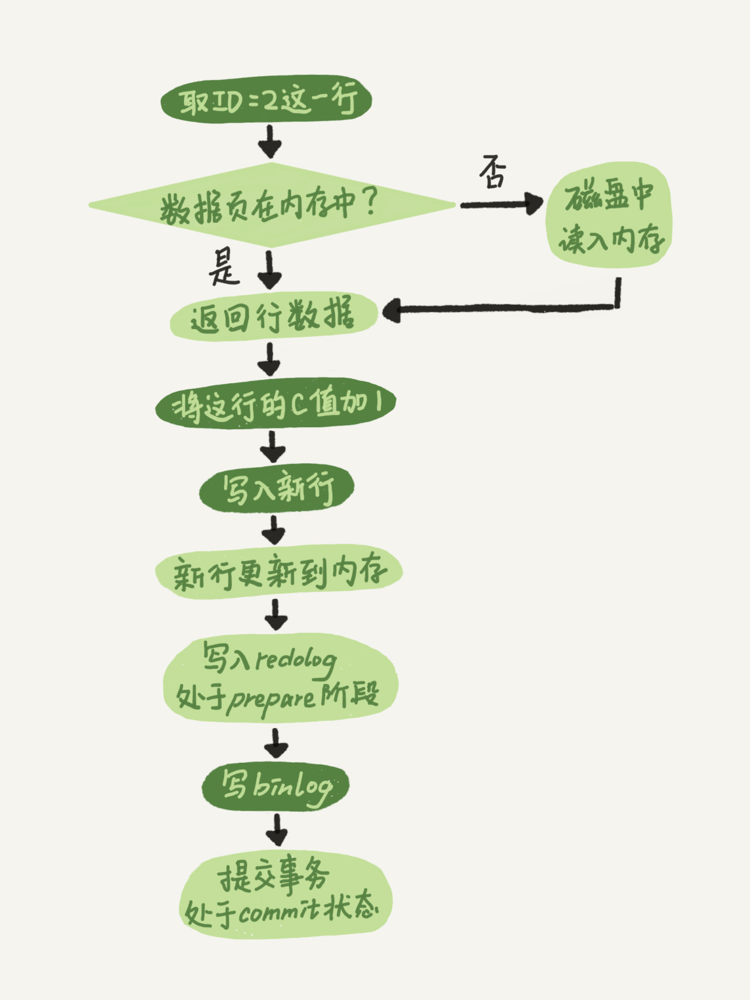

## 一、Mysql原理/基础架构：


总体来说，分为两层，Server层和存储引擎层。
Server层包含连接器、查询缓存、分析器、优化器、执行器。涵盖 MySQL 的大多数核心服务功能，以及所有的内置函数（如日期、时间、数学和加密函数等），所有跨存储引擎的功能都在这一层实现，比如存储过程、触发器、视图等。
存储引擎层主要存储、提取数据。其架构模式是**插件式的**，支持 InnoDB、MyISAM、Memory 等多个存储引擎。现在最常用的存储引擎是 InnoDB，它从 MySQL 5.5.5 版本开始成为了默认存储引擎。

### 连接器
连接器负责跟客户端建立连接（TCP）、获取权限、维持和管理连接。

命令：show processlist 显示mysql连接客户端列表。
参数：wait_timeout 控制连接时间。

### 查询缓存

MySQL 拿到一个查询请求后，会先到查询缓存看看，之前是不是执行过这条语句。之前执行过的语句及其结果可能会以 key-value 对的形式，被直接缓存在内存中。key 是查询的语句，value 是查询的结果。如果你的查询能够直接在这个缓存中找到 key，那么这个 value 就会被直接返回给客户端。

如果语句不在查询缓存中，就会继续后面的执行阶段。执行完成后，执行结果会被存入查询缓存中。
你可以看到，如果查询命中缓存，MySQL 不需要执行后面的复杂操作，就可以直接返回结果，这个效率会很高。

使用场景：除非你的业务就是有一张静态表，很长时间才会更新一次。比如，一个系统配置表，那这张表上的查询才适合使用查询缓存。

好在 MySQL 也提供了这种“按需使用”的方式。你可以将参数 query_cache_type 设置成 DEMAND，这样对于默认的 SQL 语句都不使用查询缓存。而对于你确定要使用查询缓存的语句，可以用 SQL_CACHE 显式指定，像下面这个语句一样：

```mysql
mysql> select SQL_CACHE * from T where ID=10；
```

注意：
MySQL 8.0 版本直接将查询缓存的整块功能删掉了，也就是说 8.0 开始彻底没有这个功能了。


### 分析器
会对Mysql语句进行词法分析、语句分析。
词法分析：关键字分析、表名分析、字段分析。
语法分析：当前SQL是否符合Mysql 的语法。

如果表 T 中没有字段 k，而你执行了这个语句 select * from T where k=1, 那肯定是会报“不存在这个列”的错误： “Unknown column ‘k’ in ‘where clause’”。你觉得这个错误是在我们上面提到的哪个阶段报出来的呢？答：分析器阶段会分析字段是否存在。

### 优化器
分析mysql的索引引用，选择不同，执行效率不同。还会有选错索引的情况。

### 执行器
执行器执行之前，会对要操作表的权限进行查询，没有权限返回错误
```csharp
mysql> select * from T where ID=10; ERROR 1142 (42000): SELECT command denied to user 'b'@'localhost' for table 'T'
```
如果有权限，就打开表继续执行。打开表的时候，**执行器就会根据表的引擎定义，去使用这个引擎提供的接口。**

比如表 T 中，ID 字段没有索引，那么执行器的执行流程是这样的：

1. 调用 InnoDB 引擎接口 **取这个表的第一行**，判断 ID 值是不是 10，如果不是则跳过，如果是则将这行存在结果集中；
2. 调用引擎接口 **取“下一行”**，重复相同的判断逻辑，直到取到这个表的最后一行。
3. 执行器将上述遍历过程中 所有满足条件的行 组成的记录集，作为结果集返回给客户端。

至此，这个语句就执行完成了。

对于有索引的表，执行的逻辑也差不多。
1. 第一次调用的是“取满足条件的第一行”这个接口
2. 之后循环取“满足条件的下一行”这个接口，这些接口都是引擎中已经定义好的。
你会在数据库的慢查询日志中看到一个 rows_examined 的字段，表示这个语句执行过程中扫描了多少行。这个值就是在执行器每次调用引擎获取数据行的时候累加的。

## 二、日志
 MySQL 里经常说到的 WAL 技术，WAL 的全称是 Write-Ahead Logging，它的关键点就是先写日志，再写磁盘，也就是先写粉板，等不忙的时候再写账本。

### redo log（重做日志/innodb层）


Innodb的redolog日志是固定大小的。从头到尾循环写入和擦除。

write pos 是当前记录的位置，一边写一边后移，写到第 3 号文件末尾后就回到 0 号文件开头。

checkpoint 是当前要擦除的位置，也是往后推移并且循环的，擦除记录前要把记录更新到数据文件。

crash-safe：有了 redo log，InnoDB 就可以保证即使数据库发生异常重启，之前提交的记录都不会丢失，这个能力称为**crash-safe**。


### binlog（归档日志/Server层）
redo log 是 InnoDB 引擎特有的日志，而 Server 层也有自己的日志，称为 binlog（归档日志）。
不同点：
1. redolog是innodb引擎特有的；binlog是server层特有的，所有引擎都能使用。
2. redolog是物理日志，记录当前操作在某个数据页上做什么修改；binlog属于逻辑日志，记录每一次操作的原始逻辑，也就是语句，比如“给 ID=2 这一行的 c 字段加 1 ”。
3. redlog是覆盖写入，空间固定；binlog是追加写入，这个写到一定大小不会覆盖写入，而是会写到下一个日志中。
### 对比一下日志区别
 update语句的执行流程图：
 浅色框表示是在 InnoDB 内部执行的，深色框表示是在执行器中执行的。
 
 
 简单说，redo log 和 binlog 都可以用于表示事务的提交状态，就是在redolog和binlog都写入有更新数据时，再去commit，**两阶段提交**就是让这两个状态保持逻辑上的一致。

### 扩展：
redo log 用于保证 crash-safe 能力。
innodb_flush_log_at_trx_commit 这个参数设置成 1 的时候，表示每次事务的 redo log 都直接持久化到磁盘。这个参数我建议你设置成 1，这样可以保证 MySQL 异常重启之后数据不丢失。

sync_binlog 这个参数设置成 1 的时候，表示每次事务的 binlog 都持久化到磁盘。这个参数我也建议你设置成 1，这样可以保证 MySQL 异常重启之后 binlog 不丢失。


## 三、事务
### 概念
事务就是要**保证一组数据库操作**，要么全部成功，要么全部失败。在 MySQL 中，事务支持是在引擎层实现的。

### 特性（ACID）
- 原子性A：要么全部执行成功，要么全部执行失败，不存在部分执行成功和部分执行失败的情况。
   
- 一致性C：事务内部SQL语句动作都一致，成功，都成功！失败都失败！事务执行前和执行后，数据库中的数据应该符合定义的业务规则。

- 隔离性I：并发事务时，事务和事务之间可以通过设置隔离级别，避免相互干扰！
    
- 持久性D：一旦事务提交或者回滚，数据会持久化改变！


### 事务的隔离级别


常见隔离问题：
- 脏读dirty read: A事务操作数据未提交,B事务读取到A事务操作的内容,A事务提交失败!	
- 幻读/虚读phantom read: 同一个事务内,同一个查询多次查询到的结果不一样(幻读则更侧重于新增或删除操作中出现，更新中也可能会出现)
- 不可重复读non-repeatable read: 同一个事务内,对同一份数据多次查询到的结果不一样(修改)

读未提交 read uncommitted
- 读未提交: AB两个事务操作数据的时候,A事务可以读取到B事务未提交的操作
- --->问题: 脏读 幻读 不可重复读

读已提交 read committed｜oracle的默认级别
- 读已提交: AB两个事务操作数据的时候,A事务只能读取到B提交的数据
- 避免脏读， --->问题: 幻读 不可重复读

可重复读 repeatable read｜mysql的默认级别
- 可重复读(默认隔离级别): 同一个事务内多次读取同一份数据的内容是一样	
- 避免了脏读，不可重复读， --->问题:很小概率 幻读
-  事务在执行期间看到的数据前后必须是一致的。

串行化 seriablizable
- 避免所有问题！! 读的时候加**共享锁**（其他事务可以并发读,但是不能写）。写的时候加排它锁（其他事务不能并发写也不能并发读）。当出现读写锁冲突的时候，后访问的事务必须等前一个事务执行完成，才能继续执行。但因为执行效率低，所以真正使用的场景并不多。
- 串行化: 抢一个个来 ---> 单线程操作数据库 --->没有问题
- 使用此级别。没有并发问题！


- 若隔离级别是“可重复读”，则 V1、V2 是 1，V3 是 2。之所以 V2 还是 1，遵循的就是这个要求：事务在执行期间看到的数据前后必须是一致的。
- **若隔离级别是“串行化”，则在事务 B 执行“将 1 改成 2”的时候，会被锁住。直到事务 A 提交后，事务 B 才可以继续执行。所以从 A 的角度看， V1、V2 值是 1，V3 的值是 2。**
### 事务隔离的实现

SERIALIZABLE 隔离级别是通过锁来实现的，READ-COMMITTED 和 REPEATABLE-READ 隔离级别是基于 MVCC 实现的。不过， SERIALIZABLE 之外的其他隔离级别可能也需要用到锁机制，就比如 REPEATABLE-READ 在当前读情况下需要使用加锁读来保证不会出现幻读。


长事务：启动后持续运行时间较长的事务

可重复读：
在 MySQL 中，实际上每条记录在更新的时候都会同时记录一条回滚操作。
记录上的最新值，通过回滚操作，都可以得到前一个状态的值。

假设一个值从 1 被按顺序改成了 2、3、4，在回滚日志里面就会有类似下面的记录。

当前值是 4，但是在查询这条记录的时候，不同时刻启动的事务会有不同的 read-view。

如图中看到的，在视图 A、B、C 里面，这一个记录的值分别是 1、2、4，同一条记录在系统中可以存在多个版本，就是数据库的多版本并发控制（MVCC）。
对于 read-view A，要得到 1，就必须将当前值依次执行图中所有的回滚操作得到。

同时你会发现，即使现在有另外一个事务正在将 4 改成 5，这个事务跟 read-view A、B、C 对应的事务是不会冲突的。（基于MVCC的机制）

#### MVCC
MVCC 提供了一种更为灵活的方法，允许事务在不互相阻塞的情况下同时执行（并发）。

MVCC 的基本思想是为每个事务分配一个唯一的事务标识号（Transaction ID），并为数据库中的每个数据行（记录）维护多个版本，每个版本都与一个事务标识相关联。这样，每个事务在读取数据时，可以看到某个时间点数据库的一个一致性状态，而不受其他并发事务的影响。
1. **事务标识（Transaction ID）：** 每个事务都有一个唯一的标识号，用于标识事务的开始时间。
2. **数据行版本：** 数据行（记录）可以有多个版本，每个版本都与一个事务标识相关联。版本的生成和维护是由数据库系统自动处理的。
3. **读取一致性快照：** 事务在执行时，会读取数据库的一个一致性快照，这个快照是在事务启动时确定的。这样可以确保在事务执行期间不会受到其他事务的更新影响。
4. **写操作：** 当事务对数据进行更新时，会生成一个新的版本，并且更新事务的标识号。其他事务仍然可以读取旧版本的数据。

场景：
在 MySQL 5.5 及以前的版本，回滚日志是跟数据字典一起放在 ibdata 文件里的，即使长事务最终提交，回滚段被清理，文件也不会变小。我见过数据只有 20GB，而回滚段有 200GB 的库。最终只好为了清理回滚段，重建整个库。

长事务会引起多种问题详情见[链接](http://learn.lianglianglee.com/%e4%b8%93%e6%a0%8f/MySQL%e5%ae%9e%e6%88%9845%e8%ae%b2/06%20%20%e5%85%a8%e5%b1%80%e9%94%81%e5%92%8c%e8%a1%a8%e9%94%81%20%ef%bc%9a%e7%bb%99%e8%a1%a8%e5%8a%a0%e4%b8%aa%e5%ad%97%e6%ae%b5%e6%80%8e%e4%b9%88%e6%9c%89%e8%bf%99%e4%b9%88%e5%a4%9a%e9%98%bb%e7%a2%8d%ef%bc%9f.md)

### 事务的启动

#### 如何在mysql中查看当前数据库的隔离级别：

```mysql
mysql>show variables like 'transaction_ioslation'
```

#### 显式启动事务语句
```
begin / start transaction。
配套的提交语句是 commit，回滚语句是 rollback。
```
#### 使用 set autocommit=1, 通过显式语句的方式来启动事务。

在 autocommit 为 1 的情况下，用 begin 显式启动的事务，如果执行 commit 则提交事务。
如果执行 commit work and chain，则是提交事务并自动启动下一个事务。
这样也省去了再次执行 begin 语句的开销。同时带来的好处是从程序开发的角度明确地知道每个语句是否处于事务中。

#### 查询超过60s的事务sql
在information_schema 库的 innodb_trx 这个表中查询长事务，比如下面这个语句，用于查找持续时间超过 60s 的事务。
```mysql
select * from information_schema.innodb_trx where TIME_TO_SEC(timediff(now(),trx_started))>60
```


## 四、索引

### 概念

索引实际上是为了帮助我们提高查询效率而生的。
索引本质是不同的数据模型构成的，比如哈希索引、有序数组、搜索树等。

**哈希表这种结构适用于只有等值查询的场景**
**有序数组索引只适用于静态存储引擎**，也就是不会再修改的数据存储。（如果仅仅看查询效率，有序数组就是最好的数据结构了。但是，在需要更新数据的时候就麻烦了，你往中间插入一个记录就必须得挪动后面所有的记录，成本太高。）

二叉搜索树
- 很适合磁盘存储，能够充分利用局部性原理，磁盘预读；
- 很低的树高度，能够存储大量数据，进而降低磁盘io次数；
- 索引本身占用的内存很小；
- 能够很好的支持单点查询，范围查询，有序性查询；
### 建立索引的原则：

- 经常会被用到的列优先
- 选择性高的列优先（选择性高的列意味着该列的取值较为唯一，而选择性低则表示该列的取值重复较多。）
- 宽度小 的列优先（宽度小通常指的是列的字节长度较短，故而索引长度比较小，减少开销）

### 什么时候要使用索引？

- 主键自动建立唯一索引；
- 经常作为查询条件在WHERE或者ORDER BY 语句中出现的列要建立索引；
- 作为排序的列要建立索引；
- 查询中与其他表关联的字段，外键关系建立索引
- 高并发条件下倾向组合索引；
- 用于聚合函数的列可以建立索引，例如使用了max(column_1)或者count(column_1)时的column_1就需要建立索引

### 什么时候不要使用索引？

- 经常增删改的列不要建立索引；
- 有大量重复的列不建立索引；
- 表记录太少不要建立索引。只有当数据库里已经有了足够多的测试数据时，它的性能测试结果才有实际参考价值。如果在测试数据库里只有几百条数据记录，它们往往在执行完第一条查询命令之后就被全部加载到内存里，这将使后续的查询命令都执行得非常快--不管有没有使用索引。只有当数据库里的记录超过了1000条、数据总量也超过了MySQL服务器上的内存总量时，数据库的性能测试结果才有意义。


### 索引的类型

#### 聚簇索引和非聚簇索引
聚簇索引实际上就是主键索引，非聚簇索引（又叫二级索引）就是除了主键索引以外的索引。


#### 单列索引
- 即一个索引是只根据一个字段创建的，里面只包含单个列， 一个表可以有多个单列索引（也叫单值索引）
#### 联合索引    
- 即一个索引包含多个列（也叫多值索引、多列索引）
#### 唯一索引
- 索引列的值必须唯一，但允许有空值，空值可以有多个
#### 主键索引 
- 设定为主键后数据库会自动建立索引，InnoDB 为聚簇索引

#### 覆盖索引

在 InnoDB 中，表都是根据主键顺序以索引的形式存放的，这种存储方式的表称为**索引组织表**。又因为前面我们提到的，InnoDB 使用了 B+ 树索引模型，所以数据都是存储在 B+ 树中的。
[树的知识]()
根据上面的索引结构说明，我们来讨论一个问题：**基于主键索引和普通索引的查询有什么区别？**

- 如果语句是 select * from T where ID=500，即主键查询方式，则只需要搜索 ID 这棵 B+ 树；
- 如果语句是 select * from T where k=5，即普通索引查询方式，则需要先搜索 k 索引树，得到 ID 的值为 500，再到 ID 索引树搜索一次。这个过程称为**回表**。

**也就是说，基于非主键索引的查询需要多扫描一棵索引树。因此，我们在应用中应该尽量使用主键查询。**（查询覆盖的列有索引不需要回表，没有被索引覆盖但是被查询的列会产生回表操作）

关于回表的发生，分析SQL执行流程
```sql
mysql> create table T (
ID int primary key,
k int NOT NULL DEFAULT 0, 
s varchar(16) NOT NULL DEFAULT '',
index k(k))
engine=InnoDB;
 
insert into T values(100,1, 'aa'),(200,2,'bb'),(300,3,'cc'),(500,5,'ee'),(600,6,'ff'),(700,7,'gg');


select * from T where k between 3 and 5

```


1. 在 k 索引树上找到 k=3 的记录，取得 ID = 300；
2. 再到 ID 索引树查到 ID=300 对应的 R3；
3. 在 k 索引树取下一个值 k=5，取得 ID=500；
4. 再回到 ID 索引树查到 ID=500 对应的 R4；
5. 在 k 索引树取下一个值 k=6，不满足条件，循环结束。

在这个过程中，**回到主键索引树搜索的过程，我们称为回表**。可以看到，这个查询过程读了 k 索引树的 3 条记录（步骤 1、3 和 5），回表了两次（步骤 2 和 4）。

在这个例子中，由于查询结果所需要的数据只在主键索引上有，所以不得不回表。那么，有没有可能经过索引优化，避免回表过程呢？


如果执行的语句是 select ID from T where k between 3 and 5，这时只需要查 ID 的值，而 ID 的值已经在 k 索引树上了，因此可以直接提供查询结果，不需要回表。也就是说，在这个查询里面，索引 k 已经“覆盖了”我们的查询需求，我们称为覆盖索引。

**由于覆盖索引可以减少树的搜索次数，显著提升查询性能，所以使用覆盖索引是一个常用的性能优化手段。**

建立覆盖索引的意义：

只需要读取索引而不用读取数据,大大提高查询性能。有以下优点：
1. 索引项通常比记录要小，使得MySQL访问更少的数据
2. 索引都按值排序存储，相对于随机访问记录，需要更少的I/O
3. 避免innodb主键索引的二次回表查询。
4. 大多数据引擎能更好的缓存索引。比如MyISAM只缓存索引
5. 覆盖索引对于InnoDB表尤其有用，因为InnoDB使用聚集索引组织数据，如果二级索引中包含查询所需的数据，就不再需要在主键索引中查找了（也就是不用回表查询了）
覆盖索引不能是任何索引，只有B-TREE索引存储相应的值。而且不同的存储引擎实现覆盖索引的方式都不同。
并不是所有存储引擎都支持覆盖索引(Memory/Falcon)；对于索引覆盖查询(index-covered query)，使用`EXPLAIN`时，可以在`Extra`列中看到`Using index`；在大多数引擎中，只有当查询语句所访问的列是索引的一部分时，索引才会覆盖。
但是，`InnoDB`不限于此，`InnoDB`的二级索引在叶节点中存储了primary key的值


覆盖索引失效：
- 存储引擎不支持覆盖索引
- 查询使用太多的列
- 使用了双%的like查询


example：
**在一个市民信息表上，是否有必要将身份证号和名字建立联合索引？**假设这个市民表的定义是这样的：

```sql
CREATE TABLE `tuser` (
  `id` int(11) NOT NULL,
  `id_card` varchar(32) DEFAULT NULL,
  `name` varchar(32) DEFAULT NULL,
  `age` int(11) DEFAULT NULL,
  `ismale` tinyint(1) DEFAULT NULL,
  PRIMARY KEY (`id`),
  KEY `id_card` (`id_card`),
  KEY `name_age` (`name`,`age`)
) ENGINE=InnoDB
```

我们知道，身份证号是市民的唯一标识。也就是说，如果有根据身份证号查询市民信息的需求，我们只要在身份证号字段上建立索引就够了。而再建立一个（身份证号、姓名）的联合索引，是不是浪费空间？

如果现在有一个高频请求，要根据市民的身份证号查询他的姓名，这个联合索引就有意义了。它可以在这个高频请求上用到覆盖索引，**不再需要回表查整行记录**，减少语句的执行时间。
##### 索引维护

B+ 树为了维护索引有序性，在插入新值的时候需要做必要的维护。以上面这个图为例，如果插入新的行 ID 值为 700，则只需要在 R5 的记录后面插入一个新记录。如果新插入的 ID 值为 400，就相对麻烦了，需要逻辑上挪动后面的数据，空出位置。

而更糟的情况是，如果 R5 所在的数据页已经满了，根据 B+ 树的算法，这时候需要申请一个新的数据页，然后挪动部分数据过去。这个过程称为页分裂。在这种情况下，性能自然会受影响。

除了性能外，页分裂操作还影响数据页的利用率。原本放在一个页的数据，现在分到两个页中，整体空间利用率降低大约 50%。

当然有分裂就有合并。当相邻两个页由于删除了数据，利用率很低之后，会将数据页做合并。合并的过程，可以认为是分裂过程的逆过程。

**解决方案**：
使用自增主键是指自增列上定义的主键，在建表语句中一般是这么定义的： NOT NULL PRIMARY KEY AUTO_INCREMENT。自增也会新增到下一条数据页上，即使删除了原数据页上的一条数据，原数据页不会发生分裂，总体来说无论是新增还是删除数据，查询的性能不会被影响到。

### 最左前缀原则

**B+ 树这种索引结构，可以利用索引的“最左前缀”，来定位记录。**

- 顾名思义，就是最左优先，在创建多列索引时，要根据业务需求，where子句中使用最频繁的一列放在最左边。
- 全值匹配，当按照索引中所有列进行精确匹配（这里精确匹配指“=”或“IN”匹配）时，索引可以被用到。
- 最左前缀匹配原则，非常重要的原则，mysql会一直向右匹配直到遇到范围查询(`>、<、between、like`)就停止匹配；
	- 比如a = 1 and b = 2 and c > 3 and d = 4 
	- 如果建立(a,b,c,d)顺序的索引，d是用不到索引的。
	  如果建立(a,b,d,c)的索引则都可以用到，a,b,d的顺序可以任意调整。
#### 什么叫索引的部分命中和完全命中?

- 全部命中:索引的列全部匹配从最左开始就是全部命中

- 部分命中:索引的列从最左开始只按顺序匹配了一两个，然后就从中间断了

### 索引失效情况

1. 非最左匹配

1. 错误模糊查询

    - 模糊匹配后面任意字符：like '张%'(生效)
    - 模糊匹配前面任意字符：like '%张'
    - 模糊匹配前后任意字符：like '%张%'
2. 列运算
    
    - select * from student where id+1=2(失效)
4. 使用函数
    
    - 使用mysql任意的函数就会失效。
    - 例如: select * from student where ifnull(id,0)=1 (失效)
5. 类型转换
    
    - 如果索引列在表中是字符型，搜索where条件后是整型，则存在类型转换
6. 使用 is not null
    
    - 当在查询中使用了 is not null 也会导致索引失效，而 is null 则会正常触发索引的

### 索引下推
```sql
mysql> select * from tuser where name like '张 %' and age=10 and ismale=1;
```
在 MySQL 5.6 之前，只能从 ID3 开始一个个回表。到主键索引上找出数据行，再对比字段值。

而 MySQL 5.6 引入的索引下推优化（index condition pushdown)， 可以在索引遍历过程中，对索引中包含的字段先做判断，直接过滤掉不满足条件的记录，减少回表次数。

图 3 无索引下推

图 4 有索引下推

图 3 中，在 (name,age) 索引里面我特意去掉了 age 的值，这个过程 InnoDB 并不会去看 age 的值，只是按顺序把“name 第一个字是’张’”的记录一条条取出来回表。因此，需要回表 4 次。

图 4 跟图 3 的区别是，InnoDB 在 (name,age) 索引内部就判断了 age 是否等于 10，对于不等于 10 的记录，直接判断并跳过。在我们的这个例子中，只需要对 ID4、ID5 这两条记录回表取数据判断，就只需要回表 2 次。


### 存储引擎种类

MySQL5.7支持的引擎包括：InnoDB、MyISAM、MEMORY、Archive、Federate、CSV。

#### innoDb

InnoDB的缓冲池缓存什么？有什么用？

缓存表数据与索引数据，把磁盘上的数据加载到缓冲池，避免每次访问都进行磁盘IO，起到加速访问的作用。

大于等于5.5之后，默认采用InnoDB引擎。 在mysql里面是默认引擎,拥有事务.行锁,支持高并发.可以缓存索引和真实数据.没有特别原因优先考虑innoDb引擎

#### MyISAM

- 5.5之前默认的存储引擎
- 有大量特性:全文索引、压缩、空间函数(GIS)等,不支持事务和行级锁 本身是表锁
- 缺陷是崩溃后无法安全恢复
#### Archive
- Archive档案存储引擎只支持INSERT和SELECT操作，在MySQL5.1之前不支持索引。
- Archive表适合日志和数据采集（档案）类应用
#### CSV
- csv引擎可以将数据保存到csv里面 非常做数据迁移
#### Memory
- 访问数据快,数据不会被修改,重启后丢失也没关系

#### **innodb和MyIsam的区别**

- **事务和外键**
    
    - **InnoDB**支持事务和外键，具有安全性和完整性，适合大量insert或update操作。
        
    - **MyISAM**不支持事务和外键，它提供高速存储和检索，适合大量的select查询操作
        
- **锁机制**
    
    - **InnoDB**支持行级锁，锁定指定记录。基于索引来加锁实现。[innodb默认是行锁，前提条件是建立在索引之上的。如果筛选条件没有建立索引，会降级到表锁。即如果where条件中的字段都加了索引，则加的是行锁；否则加的是表锁。]
    - **MyISAM**支持表级锁，锁定整张表。
- **索引结构**
    
    - **InnoDB**使用聚簇索引，索引和记录在一起存储，既缓存索引，也缓存记录。可以一次直接找到数据
    - **MyISAM**使用非聚簇索引，索引和记录分开。建立在聚簇索引之上，必须两次以上完成查找。
- **并发处理能力**
    
    - **InnoDB**读写阻塞可以与隔离级别有关，可以采用多版本并发控制（MVCC）来支持高并发。
    - **MyISAM**使用表锁，会导致写操作并发率低，读之间并不阻塞，读写阻塞。
- **存储文件**
    
    - **InnoDB**表对应两个文件，一个.frm表结构文件，一个.ibd数据文件。InnoDB表最大支持64TB；
    - **MyISAM**表对应三个文件，一个.frm表结构文件，一个MYD表数据文件，一个.MYI索引文件。从MySQL5.0开始默认限制是256TB。

#### 适用场景

**InnoDB**

1. 需要事务支持（具有较好的事务特性）
2. 行级锁定对高并发有很好的适应能力
3. 数据更新较为频繁的场景
4. 数据一致性要求较高
5. 硬件设备内存较大，可以利用InnoDB较好的缓存能力来提高内存利用率，减少磁盘IO

**MyISAM**

1. 不需要事务支持（不支持）
2. 并发相对较低（锁定机制问题）
3. 数据修改相对较少，以读为主
4. 数据一致性要求不高

## 五、锁机制
### 锁是什么？
控制并发事务的方式。


**根据加锁的范围，MySQL 里面的锁大致可以分成全局锁、表级锁和行锁三类**。

### 全局锁（相当于是mysql的）
**全局锁的典型使用场景是，做全库逻辑备份。**
MySQL 提供了一个加全局读锁的方法，命令是 Flush tables with read lock (FTWRL)。当你需要让整个库处于只读状态的时候，可以使用这个命令，之后其他线程的以下语句会被阻塞：数据更新语句（数据的增删改）、数据定义语句（包括建表、修改表结构等）和更新类事务的提交语句。

备份系统不加锁：
备份系统备份的得到的库不是一个逻辑时间点，这个视图是逻辑不一致的。

官方自带的逻辑备份工具是 mysqldump。当 mysqldump 使用参数–single-transaction 的时候，导数据之前就会启动一个事务，来确保拿到一致性视图。而由于 MVCC 的支持，这个过程中数据是可以正常更新的。

你一定在疑惑，有了这个功能，为什么还需要 FTWRL 呢？

**一致性读是好，但前提是引擎要支持这个隔离级别。**比如，对于 MyISAM 这种不支持事务的引擎，如果备份过程中有更新，总是只能取到最新的数据，那么就破坏了备份的一致性。这时，我们就需要使用 FTWRL 命令了。
业务的更新不只是增删改数据（DML)，还有可能是加字段等修改表结构的操作（DDL）。不论是哪种方法，一个库被全局锁上以后，你要对里面任何一个表做加字段操作，都是会被锁住的。

### 表级锁
**表锁的语法是 lock tables … read/write。**与 FTWRL 类似，可以用 unlock tables 主动释放锁，也可以在客户端断开的时候自动释放。需要注意，lock tables 语法除了会限制别的线程的读写外，也限定了本线程接下来的操作对象。

**另一类表级的锁是 MDL（metadata lock)。**MDL 不需要显式使用，在访问一个表的时候会被自动加上。MDL 的作用是，保证读写的正确性。你可以想象一下，如果一个查询正在遍历一个表中的数据，而执行期间另一个线程对这个表结构做变更，删了一列，那么查询线程拿到的结果跟表结构对不上，肯定是不行的。


因此，在 MySQL 5.5 版本中引入了 MDL，当对一个表做增删改查操作的时候，加 MDL 读锁；当要对表做结构变更操作的时候，加 MDL 写锁。

- 读锁之间不互斥，因此你可以有多个线程同时对一张表增删改查。
- 读写锁之间、写锁之间是互斥的，用来保证变更表结构操作的安全性。因此，如果有两个线程要同时给一个表加字段，其中一个要等另一个执行完才能开始执行。

虽然 MDL 锁是系统默认会加的，但却是你不能忽略的一个机制。
MDL 会直到事务提交才释放，在做表结构变更的时候，你一定要小心不要导致锁住线上查询和更新。

### 行锁和表锁的区别


- **表级锁：** MySQL 中锁定粒度最大的一种锁（全局锁除外），是针对非索引字段加的锁，对当前操作的整张表加锁，实现简单，资源消耗也比较少，加锁快，不会出现死锁。不过，触发锁冲突的概率最高，高并发下效率极低。**表级锁和存储引擎无关**，MyISAM 和 InnoDB 引擎都支持表级锁。
- **行级锁：** MySQL 中锁定粒度最小的一种锁，是 **针对索引字段加的锁** ，只针对当前操作的行记录进行加锁。 行级锁能大大减少数据库操作的冲突。其加锁粒度最小，并发度高，但加锁的开销也最大，加锁慢，会出现死锁。**行级锁和存储引擎有关**，是在存储引擎层面实现的。


### 行级锁的使用有什么注意事项？
InnoDB 的行锁是针对索引字段加的锁，表级锁是针对非索引字段加的锁。当我们执行 `UPDATE`、`DELETE` 语句时，如果 `WHERE`条件中字段没有命中唯一索引或者索引失效的话，就会导致扫描全表对表中的所有行记录进行加锁。这个在我们日常工作开发中经常会遇到，一定要多多注意！！！

不过，很多时候即使用了索引也有可能会走全表扫描，这是因为 MySQL 优化器的原因。

### InnoDB 有哪几类行锁？

InnoDB 行锁是通过对索引数据页上的记录加锁实现的，MySQL InnoDB 支持三种行锁定方式：

- **记录锁（Record Lock）**：也被称为记录锁，属于单个行记录上的锁。
- **间隙锁（Gap Lock）**：锁定一个范围，不包括记录本身。
- **临键锁（Next-Key Lock）**：Record Lock+Gap Lock，锁定一个范围，包含记录本身，主要目的是为了解决幻读问题（MySQL 事务部分提到过）。记录锁只能锁住已经存在的记录，为了避免插入新记录，需要依赖间隙锁。

**在 InnoDB 默认的隔离级别 REPEATABLE-READ 可重复读 下，行锁默认使用的是 Next-Key Lock 临键锁。但是，如果操作的索引是唯一索引或主键，InnoDB 会对 Next-Key Lock 进行优化，将其降级为 Record Lock 记录锁，即仅锁住索引本身，而不是范围。**

### 共享锁和排他锁呢？

不论是表级锁还是行级锁，都存在共享锁（Share Lock，S 锁）和排他锁（Exclusive Lock，X 锁）这两类：

- **共享锁（S 锁）**：又称读锁，事务在读取记录的时候获取共享锁，允许多个事务同时获取（锁兼容）。
- **排他锁（X 锁）**：又称写锁/独占锁，事务在修改记录的时候获取排他锁，不允许多个事务同时获取。如果一个记录已经被加了排他锁，那其他事务不能再对这条事务加任何类型的锁（锁不兼容）。

**排他锁与任何的锁都不兼容，共享锁仅和共享锁兼容。**

|     | S 锁 | X 锁 |
| --- | --- | --- |
| S 锁 | 不冲突 | 冲突  |
| X 锁 | 冲突  | 冲突  |


由于 MVCC 的存在，对于一般的 `SELECT` 语句，InnoDB 不会加任何锁。
通过以下语句显式加共享锁或排他锁。

```
# 共享锁 可以在 MySQL 5.7 和 MySQL 8.0 中使用
SELECT ... LOCK IN SHARE MODE;
# 共享锁 可以在 MySQL 8.0 中使用
SELECT ... FOR SHARE;
# 排他锁
SELECT ... FOR UPDATE;
```


[意向锁](https://javaguide.cn/database/mysql/mysql-questions-01.html#%E6%84%8F%E5%90%91%E9%94%81%E6%9C%89%E4%BB%80%E4%B9%88%E4%BD%9C%E7%94%A8)
[自增锁](https://javaguide.cn/database/mysql/mysql-questions-01.html#%E8%87%AA%E5%A2%9E%E9%94%81%E6%9C%89%E4%BA%86%E8%A7%A3%E5%90%97)
## 六、性能优化
#### SQL优化
1. 尽量选择较小的列
2. 将where中用的比较频繁的字段建立索引
3. select子句中避免使用‘*’
4. 避免在索引列上使用计算、not in 和 <>等操作。
5. 当只需要一行数据的时候。使用limit 1
6. 但表数据不超过200w，适时分割表。针对查询较慢的语句，可以使用explain来分析该语句的具体执行情况。
7. 避免改变索引列的类型
8. 选择最有效的表名顺序，from字句中写在最后的表是基础表，将被最先处理，在from子句中包含多个表的情况下，你必须选择记录条数最少的表作为基础表。
9. 尽量缩小子查询的结果

## 七、场景：
### 长连接占用内存过大，被OOM，现象：Mysql重启！
解决方案：考虑以下两种方案。
1. 定期断开长连接。使用一段时间，或者程序里面判断执行过一个占用内存的大查询后，断开连接，之后要查询再重连。
2. 如果你用的是 MySQL 5.7 或更新版本，可以在每次执行一个比较大的操作后，通过执行 mysql_reset_connection 来重新初始化连接资源。这个过程不需要重连和重新做权限验证，但是会将连接恢复到刚刚创建完时的状态。


### 如何安全地给小表加字段？

首先我们要解决长事务，事务不提交，就会一直占着 MDL 锁。在 MySQL 的 information_schema 库的 innodb_trx 表中，你可以查到当前执行中的事务。如果你要做 DDL 变更的表刚好有长事务在执行，要考虑先暂停 DDL，或者 kill 掉这个长事务。

但考虑一下这个场景。如果你要变更的表是一个热点表，虽然数据量不大，但是上面的请求很频繁，而你不得不加个字段，你该怎么做呢？

这时候 kill 可能未必管用，因为新的请求马上就来了。比较理想的机制是，在 alter table 语句里面设定等待时间，如果在这个指定的等待时间里面能够拿到 MDL 写锁最好，拿不到也不要阻塞后面的业务语句，先放弃。之后开发人员或者 DBA 再通过重试命令重复这个过程。

MariaDB 已经合并了 AliSQL 的这个功能，所以这两个开源分支目前都支持 DDL NOWAIT/WAIT n 这个语法。

```sql
ALTER TABLE tbl_name NOWAIT add column ...
ALTER TABLE tbl_name WAIT N add column ... 
```

### 多事务下并发问题的解决方案


MySQL 中并发事务的控制方式无非就两种：**锁** 和 **MVCC**。锁可以看作是悲观控制的模式，多版本并发控制（MVCC，Multiversion concurrency control）可以看作是乐观控制的模式。


## 八、部署方案：｜待补充
### 主从复制：

### 分库分表：


## 项目中：

### 有百万级数据查询调优的实战经验


1. 先用explain分析查询的执行计划。
2. 看explain返回到信息：**type** 中命中的是哪个索引。确认数据量**rows**，大小。还有**Extra**字段的一些额外的信息，例如使用了临时表、使用了文件排序等。
3. 进行优化sql

SELECT
    e.department_id,
    COUNT(c.customer_id) AS total_customers
FROM
    employees e
LEFT JOIN
    customer_counts c ON e.employee_id = c.employee_id
GROUP BY
    e.department_id;

1. 切换from 后的基础表，小表关联大表，以减少数据量。
2. 使用聚簇索引，而不是普通索引。
3. 使用INNER JOIN替换LEFT JOIN减少查询的数据量和开销。
4. **使用 GROUP BY：** 确保 GROUP BY 子句中仅包含必要的列，避免不必要的聚合操作。

2分钟半优化到-> 9s 结果需求被砍掉。


## 参考链接：
[技术摘抄](http://learn.lianglianglee.com/%E4%B8%93%E6%A0%8F/MySQL%E5%AE%9E%E6%88%9845%E8%AE%B2)

[JavaGuide](https://javaguide.cn/database/mysql/mysql-questions-01.html#mysql-%E5%9F%BA%E7%A1%80%E6%9E%B6%E6%9E%84)

[Mysql优化](https://yijiyong.com/db/mysqlopt2/01-districtandtable.html)